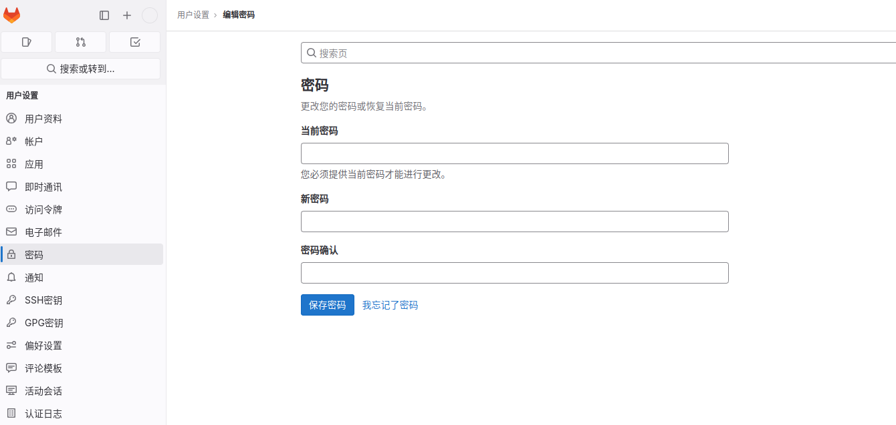
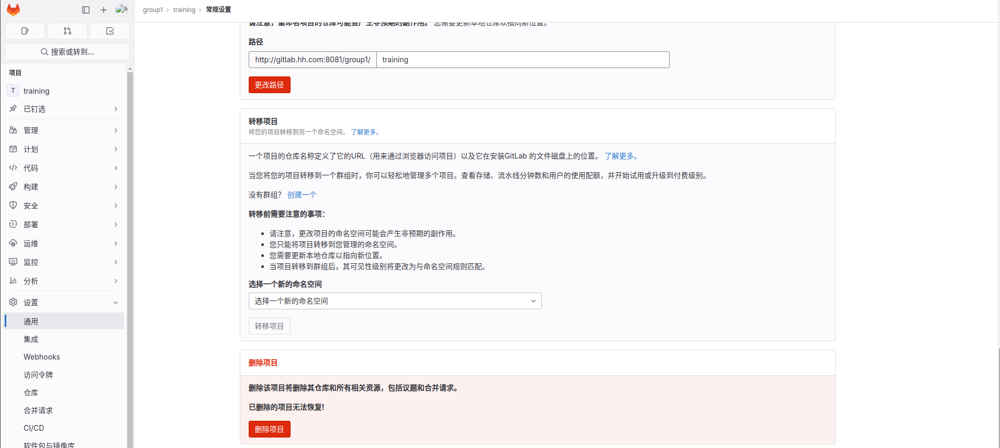

# Ubuntu

## docker方式搭建gitlab

1.执行docker命令

启动估计需要2分钟

```shell
docker run --detach \
    --hostname gitlab.hh.com \
    --publish 8443:443 --publish 80:80 --publish 8022:22 \
    --name gitlab \
    --restart always \
    --volume /data/gitlab/config:/etc/gitlab \
    --volume /data/gitlab/logs:/var/log/gitlab \
    --volume /data/gitlab/data:/var/opt/gitlab \
    --shm-size 2g \
    gitlab/gitlab-ce:16.4.2-ce.0
```

2.配置/etc/hosts

查看本机ip

```shell
ifconfig enp2s0
# 查看结果
enp2s0: flags=4163<UP,BROADCAST,RUNNING,MULTICAST>  mtu 1500
        inet 192.168.5.34  netmask 255.255.255.0  broadcast 192.168.5.255
        inet6 fe80::e905:2bcf:f95d:4d5  prefixlen 64  scopeid 0x20<link>
        ether 00:68:eb:bf:b6:a2  txqueuelen 1000  (以太网)
        RX packets 16389236  bytes 8491541210 (8.4 GB)
        RX errors 0  dropped 0  overruns 0  frame 0
        TX packets 6541729  bytes 894963265 (894.9 MB)
        TX errors 0  dropped 0 overruns 0  carrier 0  collisions 0
```

/etc/hosts 中添加一条 `192.168.5.34 gitlab.hh.com`

3.登录
访问： http://gitlab.hh.com

用户名：root
查看初始密码：

```shell
sudo cat /data/gitlab/config/initial_root_password
```

4.设置语言
点击头像->`Preferences`(偏好)->找到`Language`->选`中文`保存->刷新

5.重置管理员密码

方法一：

```shell
#进入容器
docker exec -it gitlab bash
#进入gitlab 控制台
gitlab-rails console -e production   #可能会等好几秒钟
#这里提供两种搜索方式  通过id
user = User.where(id:1).first
#或者 通过电子邮件搜索  或者用户名
user = User.find_by(email:'admin@example.com')
#修改密码
#注意  这两个选项都得设置，  pass  为你要设置的密码
user.password ='pass'
user.password_confirmation ='pass'
#保存退出
user.save
```

```shell
docker exec -it gitlab bash
root@gitlab:/# gitlab-rails console -e production
--------------------------------------------------------------------------------
 Ruby:         ruby 3.0.6p216 (2023-03-30 revision 23a532679b) [x86_64-linux]
 GitLab:       16.4.2 (67c88353b76) FOSS
 GitLab Shell: 14.28.0
 PostgreSQL:   13.11
------------------------------------------------------------[ booted in 26.59s ]
Loading production environment (Rails 7.0.6)
irb(main):001:0> user = User.where(id: 1).first
=> #<User id:1 @root>
irb(main):002:0> user.password = 'Kenyin123'
=> "Kenyin123"
irb(main):003:0> user.password_confirmation = 'Kenyin123'
=> "Kenyin123"
irb(main):004:0> user.save
=> true
```

方法二：

点击头像


6.新建项目

选择群组

7.删除项目

点击要删除的项目，然后：


```shell
cd existing_repo
#如果报错 `fatal: 远程 origin 已经存在。`，需要 `git remote rm origin`
git remote add origin http://gitlab.hh.com/group1/training.git
git branch -M main
git push -uf origin main
```

8.修改配置

```shell
#进容器内部
docker exec -it gitlab /bin/bash

#修改gitlab.rb
vi /etc/gitlab/gitlab.rb

#加入如下
#gitlab访问地址，可以写域名。如果端口不写的话默认为80端口
# 如果使用公有云且配置了域名了，可以直接设置为域名
external_url 'http://192.168.124.194'
#ssh主机ip
# 同样如果有域名，这里也可以直接使用域名
gitlab_rails['gitlab_ssh_host'] = '192.168.124.194'
#ssh连接端口
# 端口为启动docker时映射的ssh端口
gitlab_rails['gitlab_shell_ssh_port'] = 8022

# 让配置生效
gitlab-ctl reconfigure
```

参考：

[全流程Ubuntu安装Docker版Gitlab并初始化管理员](https://cloud.tencent.com/developer/article/2256871)

[Gitlab----使用Docker方式安装部署Gitlab](https://developer.aliyun.com/article/922952)

[5分钟带你重置Gitlab管理员账户密码](https://developer.aliyun.com/article/1356206)

[Docker中安装Gitlab详细全教程](https://blog.csdn.net/lianxiaohei/article/details/122665812)

[docker安装 docker安装gitlab](https://blog.51cto.com/u_16099331/6419143)

[官网](https://docs.gitlab.com/ee/install/docker.html)

## GitLab-Runner环境安装配置

```shell
docker pull gitlab/gitlab-runner:v16.4.2
```

```shell
docker run -d --name gitlab-runner --restart unless-stopped \
  -v /data/gitlab-runner/config:/etc/gitlab-runner \
  -v /var/run/docker.sock:/var/run/docker.sock \
  gitlab/gitlab-runner:v16.4.2
```

进入容器

```shell
docker exec -it gitlab-runner /bin/bash

gitlab-ci-multi-runner register
```

注册Runner

```shell
root@2c16245efcc7:/# gitlab-ci-multi-runner register
Runtime platform                                    arch=amd64 os=linux pid=45 revision=e77af703 version=16.4.2
Running in system-mode.

Enter the GitLab instance URL (for example, https://gitlab.com/):
#输入
http://192.168.5.34/
Enter the registration token:
#输入
GR1348941veATFuzokzpXqwyCN8uP
Enter a description for the runner:
#输入
[2c16245efcc7]: test_runner
Enter tags for the runner (comma-separated):
#输入
test
Enter optional maintenance note for the runner:
#输入
test
WARNING: Support for registration tokens and runner parameters in the 'register' command has been deprecated in GitLab Runner 15.6 and will be replaced with support for authentication tokens. For more information, see https://docs.gitlab.com/ee/ci/runners/new_creation_workflow
Registering runner... succeeded                     runner=GR1348941veATFuzo
Enter an executor: virtualbox, docker+machine, custom, docker, docker-windows, parallels, shell, ssh, kubernetes, docker-autoscaler, instance:
#输入
shell
Runner registered successfully. Feel free to start it, but if it's running already the config should be automatically reloaded!

Configuration (with the authentication token) was saved in "/etc/gitlab-runner/config.toml"
```

参考：

[官网](https://docs.gitlab.cn/runner/install/docker.html)

[Docker + GitLab + GitLab Runner 自动化部署](https://robking.top/archives/%E4%BA%91%E5%8E%9F%E7%94%9Fdockergitlabgitlabrunner%E8%87%AA%E5%8A%A8%E5%8C%96%E9%83%A8%E7%BD%B2)

[GitLab-Runner 从安装到配置到入门](https://blog.csdn.net/zyy247796143/article/details/123842374)
