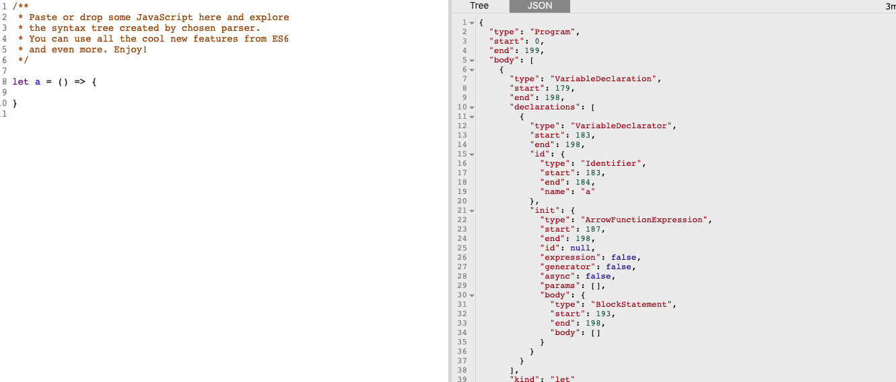
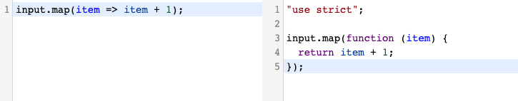

title: Babel
speaker: Allen Li

<slide />

# Babel

Allen Li

<slide />

## Why Babel

由于 es6 等语法目前还无法被所有浏览器完全支持，就需要一款工具将 es6 的语法转换成浏览器所支持的语法。于是 babel 应运而生。

babel 所做的操作主要可以分为三个步骤：

- parse       （code => ast）
- transform   （ast => 转换后的 ast）
- generate    （转换后的 ast => es5 代码）

<slide />

## 预览

:::column {.vertical}

```js
class Babel {}
```

----

```js
"use strict";

function _instanceof(left, right) {
    if (right != null && typeof Symbol !== "undefined" && right[Symbol.hasInstance]) {
        return !!right[Symbol.hasInstance](left); } else { return left instanceof right;
    }
}

function _classCallCheck(instance, Constructor) {
    if (!_instanceof(instance, Constructor)) {
        throw new TypeError("Cannot call a class as a function");
    }
}

var Babel = function Babel() {
  _classCallCheck(this, Babel);
};
```

<slide />

## plugin

babel 的强大之处还在于开发者可以根据自己的需求编写插件来增强 babel 的功能。

- @babel/plugin-proposal-class-properties（用来支持 class 属性）。
- @babel/plugin-transform-runtime（自动 polyfill es5 不支持的 api）。
- @babel/plugin-syntax-dynamic-import（支持 `import()` 动态导入语法）。
- ......

<slide />

## preset

除了一个一个的添加插件，你还可以以 preset 的形式启用一组插件，preset 可以理解为插件的集合，每个集合里打包了不同的插件。

```js
presets: [
    ['@babel/preset-env', {
        targets: {
        browsers: ['> 1%', 'last 2 versions', 'not ie <= 8'],
        },
        modules: false,
    }],
]
```

<slide />

## parse

babel 通过 `@babel/parser` 将 code 解析为 `AST`（Abstract syntax tree 抽象语法树），可以使用 [astexplorer](https://astexplorer.net/) 来测试。



<slide />

## transform

这是 babel 工作的关键阶段，babel 把解析生成的 AST 通过 `@babel/traverse` 进行深度优先遍历，并在此过程中对节点进行添加、更新、移除等操作。这也是 Babel 插件介入的阶段。

<slide />

## generate

将经过转换的 AST 通过 `@babel/generator` 再转换成 js 代码，过程就是深度优先遍历整个 AST，然后构建可以表示转换后代码的字符串。



<slide />

## 参考

- [Babel 官方文档](https://babeljs.io/docs/en/)
- [AST 在线转换工具](https://astexplorer.net/)
- [Babel 在线转换工具](https://babeljs.io/repl)
