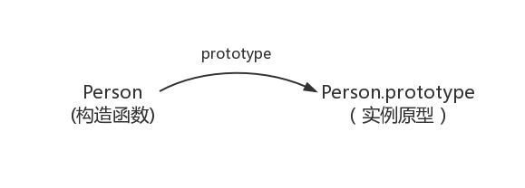

title: ECMAScript 基础
speaker: Allen Li

<slide />

# ECMAScript 基础

Allen Li

<slide />

## 什么是 ECMA

ECMAScript 是 ECMA（European Computer Manufacturers Association）组织定制的 JavaScript 语言标准。

<slide />

## 数据类型

- 基本类型
    - String
    - Number
    - Symbol（ES6）
    - Null
    - Undefined
    - Boolean
- 引用类型
    - Object

<slide />

## 变量

:::column {.vertical}

在 ES6 之前声明变量用 `var`，`var` 是不存在块级作用域的，所以下面代码 console 是可以输出 a 的值的。

```js
{
  var a = 10;
}

console.log(a); // 10
```

----

ES6 新增了 `let`、`const`，他们 `var` 的区别在于 `let` 会创建块级作用域，`const` 也会创建块级作用域并且声明的变量不可修改。

```js
{
  let a = 10;
  const b = 20;
}

console.log(a); // ReferenceError: a is not defined.
```

<slide class="slide-top" />

## 闭包

闭包就是能够读取其他函数内部变量的函数，通过一道经典的面试题来熟悉一下闭包：

:::column {.vertical}

非闭包：

```js
var data = [];

for (var i = 0; i < 3; i++) {
  data[i] = function () {
    console.log(i);
  };
}

data[0](); // 3
data[1](); // 3
data[2](); // 3
```

----

闭包：

```js
var data = [];

for (var i = 0; i < 3; i++) {
  data[i] = (function(j) {
    return function () {
      console.log(j);
    }
  })(i);
}

data[0](); // 0
data[1](); // 1
data[2](); // 2
```

<slide />

## 原型链

在 ES6 之前，JS 是不区分类和实例的概念的，而是通过原型（prototype）来实现面向对象的编程。

```js
function Person() {

}

var person = new Person();
person.name = 'Allen';
console.log(person.name) // Allen
```

在这个例子中，Person 就是一个构造函数，我们使用 new 创建了一个实例对象 person。

<slide />

### prototype

:::column {.vertical}

原型可以理解为：每个 JS 对象在创建的时候就会关联另外一个对象，每个对象都会从这个关联对象“继承”属性，这个对象就叫做原型。

```js
function Person() {

}

Person.prototype.name = 'Kevin';
var person1 = new Person();
var person2 = new Person();
console.log(person1.name) // Kevin
console.log(person2.name) // Kevin
```

----



<slide />

### \_\_proto\_\_

:::column {.vertical}

这是每一个 JavaScript 对象（除了 null）都具有的一个属性，叫 `__proto__`，这个属性会指向该对象的原型。

```js
function Person() {

}

var person = new Person();
console.log(person.__proto__ === Person.prototype); // true
```

----


<slide />

### constructor

:::column {.vertical}

每个原型都有一个 constructor 属性指向关联的构造函数。

```js
function Person() {

}

console.log(Person === Person.prototype.constructor); // true
```

----


<slide />

### 实例与原型

:::column {.vertical}

当读取实例的属性时，如果找不到，就会查找与对象关联的原型中的属性，如果还查不到，就去找原型的原型，一直找到最顶层为止。

```js
function Person() {

}

var person = new Person();
console.log(Person.prototype.__proto__.constructor === Object); // true
console.log(Person.prototype.__proto__ === Object.prototype); // true
```

----

原型也是一个对象，所以原型对象也是存在原型的，在 JS 中原型对象是通过 `Object` 构造生成的，所以原型对象的构造函数就是 `Object`，而原型对象的原型就是 `Object.prototype`。


<slide />

### 原型链的终点

:::column {.vertical}

Object.prototype 的原型则指向 `null`，也就是没有值。

```js
console.log(Object.prototype.__proto__ === null); // true
```

----


<slide />

## 继承

JS 在 ES6 之前并不存在 class 这一类型，好在有原型链这种机制的存在，使得 JS 可以基于原型链来实现继承。

:::column {.vertical}

- 组合继承

  ```js
  function Parent() {
    this.names = ['kevin', 'daisy'];
  }

  Parent.prototype.getName = function() {
    console.log(this.name);
  }

  function Child(age) {
    Parent.call(this);
    this.age = age;
  }

  Child.prototype = new Parent();
  Child.prototype.constructor = Child;
  ```

----

- 寄生组合式继承

  ```js
  function Parent() {
    this.names = ['kevin', 'daisy'];
  }

  Parent.prototype.getName = function() {
    console.log(this.name);
  }

  function Child(age) {
    Parent.call(this);
    this.age = age;
  }

  var F = function() {};
  F.prototype = Parent.prototype;
  Child.prototype = new F();
  Child.prototype.constructor = Child
  ```

<slide />

## 浏览器中的 Event Loop

- 浏览器的 Event Loop 是在 html5 的规范中明确定义，具体是由浏览器厂商来实现的。
- NodeJS 的 Event Loop 是基于 libuv 实现的。


<slide />

### 任务队列

所有的任务可以分为两种，一种是 `同步任务`，另一种是 `异步任务`。在主线程运行的代码属于同步任务，而像 `setTimeout`、`Promise().then()` 等，任务的回调不在主线程直接执行，而进入 `异步队列` 的任务称为异步任务，只有当主线程空闲才会去异步队列中依次执行任务，其中异步任务队列分为两种：

- microtask（微任务）
- macrotask（宏任务）

<slide />

### microtask

- Promise
- MutationObserver
- MessageChannel

<slide />

### macrotask

- setTimeout
- setInterval
- requestAnimationFrame

<slide />

### 优先级

microtask 的优先级要高于 macrotask。每次主线程调用栈清空后，会从 microtask 队首取出一个任务放入调用栈执行，直到 microtask 队列清空在从 macrotask 队首取出任务放入调用栈执行，之后在从头重复整个流程。

```js
console.log('script start');

setTimeout(function() {
  console.log('setTimeout');
}, 0);

new Promise(function(resolve) {
  console.log('resolve')
  resolve();
}).then(function() {
  console.log('promise1');
});

console.log('script end');

// script start
// resolve
// script end
// promise1
// setTimeout
```
