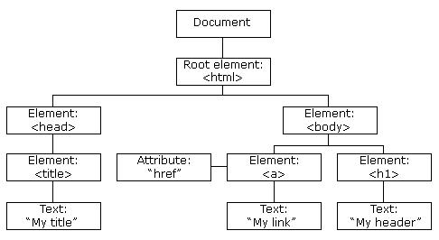

title: HTML
speaker: Allen Li

<slide />

# HTML

Allen Li

<slide />

## 基本结构

超文本标记语言（英语：HyperText Markup Language，简称：HTML）是一种用于创建网页的标准标记语言。

```html
<!DOCTYPE html>
<html lang="en">
<head>
  <meta charset="UTF-8">
  <meta name="viewport" content="width=device-width, initial-scale=1.0">
  <meta http-equiv="X-UA-Compatible" content="ie=edge">
  <link rel="stylesheet" href="my-css-file.css">
  <title>Document</title>
</head>
<body>
  <div id="app"></div>
  <script src=/js/app.b2b04e9d.js></script>
</body>
</html>
```

<slide />

## DOCTYPE

`<!DOCTYPE>` 声明告诉代码校验器或者浏览器应该按照什么规则集解析文档，这些规则就是 W3C 发表的文档类型定义（DTD）中包含的规则。

```html
语法：<!DOCTYPE 根元素 可用性 "注册//组织//类型 标签 定义//语言" "URL">

<!DOCTYPE html PUBLIC "-//W3C//DTD HTML 4.01 Transitional//EN" "http://www.w3.org/TR/html4/loose.dtd">
```

在HTML 4.01 中，<!DOCTYPE> 声明需引用 DTD （文档类型声明），因为 HTML 4.01 是基于 SGML（Standard Generalized Markup Language 标准通用标记语言）。

HTML5 不是基于 SGML，因此不要求引用 DTD。

<slide />

## Head

在页面加载完成的时候，`head` 标签中的内容是不会显示出来的，它的作用是包含一些页面的元数据。

- title：它可以用来给 HTML 文档添加标题，`title` 是用来表示整个 HTML 文档的标题的元数据（不是文档的内容）。
- meta：`meta` 是描述数据的数据，也称为元数据，HTML 为一个文档添加元数据的方式就是使用 `meta` 标签。
- link：经常位于文档的头部。`link` 元素通常指定 2 个属性，`rel="stylesheet"` 表明这是文档的样式表，而 `href` 包含了样式表文件的路径。

<slide class="slide-top" />

## BOM

BOM（浏览器对象模型）提供了大量的对象，用于访问浏览器的各种功能，例如浏览器实例、窗口大小等信息，这些功能与任何网页内容无关。

<slide class="slide-top" />

## window

BOM 的核心对象是 window，它表示浏览器的一个实例。在浏览器中 window 扮演者双重角色，它既是通过 JavaScript 访问浏览器窗口的一个接口，又是 ECMAScript 规定的 Global 对象，这也是为什么我们并没有定义却可以直接在代码中访问 `setTimeout`、`parseInt` 等方法的原因。

<slide />

## DOM

DOM（文档对象模型）是针对 HTML 和 XML 文档的一个 API。DOM 描绘了一个层次化的节点树，允许开发人员添加、移除和修改页面的某一部分。



<slide />

## Node 类型

DOM 定义了 12 中 Node 类型，任何节点类型必居其一：

- Node.ELEMENT_NODE(1)
- Node.ATTRIBUTE_NODE(2)
- Node.TEXT_NODE(3)
- Node.CDATA_SECTION_NODE(4)
- Node.ENTITY_REFERENCE_NODE(5)
- Node.ENTITY_NODE(6)
- Node.grpcING_INSTRUCTION_NODE(7)
- Node.COMMENT_NODE(8)
- Node.DOCUMENT_NODE(9)
- Node.DOCUMENT_TYPE_NODE(10)
- Node.DOCUMENT_FRAGMENT_NODE(11)
- Node.NOTATION_NODE(12)

<slide />

## document

document 对象是 HTMLDocument（集成自 Document 类型）的一个实例，表示整个 HTML 页面。通过 document 可以取得与页面相关的信息，还能操作页面的节点。

```js
// 创建 div 元素
const div = document.createElement('div');
// 将 div 添加到 html 的 body 中
document.body.appendChild(div);
// 创建 div 元素
const p = document.createElement('p');
// 设置 id
p.id = 'test';
// 设置内容
p.innerHTML = 'Hello World!';
// 将 p 添加到 div 中
div.appendChild(p);
// 获取 p 元素
const element = document.getElementById('test');
// 修改内容
element.innerHTML = 'Hello HTML!';
// 从 div 中 移除 p
div.removeChild(p);
```

<slide />

## 适配

当我们在写移动端布局的时候，由于手机的屏幕尺寸，像素密度千差万别，不能直接按照设计图的标注来写，需要根据不同屏幕的宽度以及像素密度来做适配，常见的方案有以下几种：

- em：参考的是父元素的 `font-size`，具有继承的特点。如果自身定义了 font-size 则按自身的来计算（浏览器默认字体是 16px），整个页面内 1em 不一定是一个固定的值（此方案在群脉基本没有使用）。
- rem：css3 新单位，相对于根元素 html（网页）的 font-size，不会像 em 那样，依赖于父元素的字体大小，而造成混乱。
- vw：css3 新单位，`viewpoint width` 的缩写，视窗宽度，1vw 等于视窗宽度的 1%。

<slide />

## 参考

- JavaScript 高级程序设计
- [HTML教程](https://developer.mozilla.org/zh-CN/docs/Web)
- [flexBox](https://www.ruanyifeng.com/blog/2015/07/flex-grammar.html)
