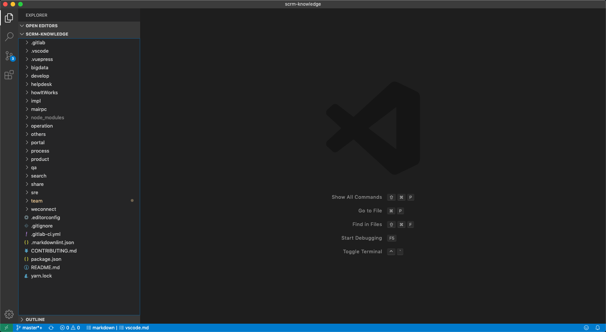
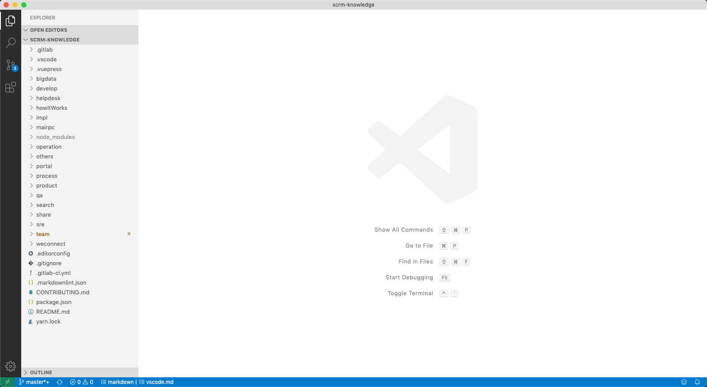

title: VS Code
speaker: Rob Gu

<slide />

# VS Code

Rob Gu

<slide />

## Visual Studio Code

- 下载 & 安装
- 界面 & 主题
- 常用设置
- 常用快捷键
- 插件安装

<slide />

### 下载 & 安装

- [下载](https://code.visualstudio.com/)

<slide />

### 界面 & 主题

{width=500px}
{width=500px}

<slide />

### 常用设置

- editor.renderWhitespace
- editor.wordWrapColumn
- files.autoSave
- files.eol
- files.insertFinalNewline
- files.trimFinalNewlines
- files.trimTrailingWhitespace

<slide />

### 常用快捷键

- 展示所有命令：Ctrl + Shift + P
- 快速打开文件：Ctrl + P
- 查找：Ctrl + F
- 全局查找：Ctrl + Shift + F
- 多光标
    - Ctrl + Alt + Up/Down
    - Alt + 鼠标点击
- 选中同一单词(从上往下，一次一个)：Ctrl + D
- 选中所有同一单词：Ctrl + Shift + L
- 上下移动行：Alt + Up/Down
- 行缩进：Ctrl + [ 、 Ctrl + ]
- [所有默认快捷键](https://code.visualstudio.com/docs/getstarted/keybindings#_default-keyboard-shortcuts)
- Mac 下所有 Ctrl 替换为 CMD 键

<slide />

### 插件

- streetsidesoftware.code-spell-checker
- eamodio.gitlens

<slide />

### Q & A

<slide />

### Thanks
