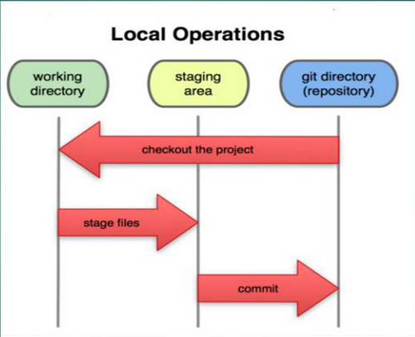
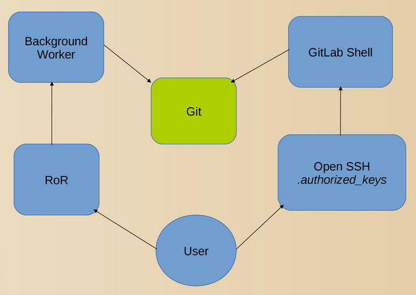

title: Git & Code Review
speaker: Aaron Wang

<slide />

# Git & Code Review

Aaron Wang

<slide />

## Git

- 以[廖雪峰 Git 教程](https://www.liaoxuefeng.com/wiki/896043488029600)为主，至少先读完前五章（有计划的把其它章节也读了），这里只做强调和补充。
- 务必系统学习，多练习、多思考，注意读懂 Git 的提示，不要胡乱尝试，Git 很考验一个人的学习能力和动手能力。
- 扩展阅读：[Oh Shit, Git!?!](https://ohshitgit.com/)。

<slide />

## Git 初始配置

```shell
git config --global user.name "Aaron Wang" # 换成自己的名字
git config --global user.email aaron.wang@maiscrm.com # 换成自己的邮箱
git config --global core.editor vim
git config --global core.quotepath false
git config --global push.default simple
git config --global rerere.enabled true
git config --global alias.d "diff"
git config --global alias.dc "diff --cached"
git config --global alias.s status -sb
git config --global alias.l "log --all --graph --pretty=format:'%Cred%h%Creset -%C(yellow)%d%Creset %s %Cgreen(%cr) %C(bold blue)<%an>%Creset' --abbrev-commit --date=relative"
git config --global alias.b branch
git config --global alias.c checkout
git config --global alias.r reset
git config --global alias.f fetch
git config --global alias.m merge
git config --global alias.p pull
git config --global alias.pr "pull --rebase"
git config --global alias.pu "push -u"
git config --global alias.cp cherry-pick
git config --global alias.cm "commit --amend"
git config --global alias.reset-permission '!git diff -p -R --no-color | grep -E "^(diff|(old|new) mode)" --color=never | git apply'
```

配置文件优先级：`.git/config > ~/.gitconfig > /etc/gitconfig`

<slide />

## 正确使用 .gitignore 忽略无需提交的文件

- 一般无需提交的文件包括：
    - 编辑器、IDE 的状态文件或临时文件（可整个团队共享的配置文件是建议提交的）。
    - 编译或构建生成的文件。
    - 第三方依赖，建议用相应的包管理器。
- [常用模板](https://github.com/github/gitignore)

<slide />

## 理解 working directory、staging area、git directory



<slide />

## 理解 checkout、reset、revert（撤销改动）

- uncached：`git checkout <paths>`
- cached：`git reset <tree-ish> -- <paths>`
- committed：
    - `git reset <tree-ish> -- <paths>; git checkout <paths>`
    - `git reset <commit> --hard`
    - `git revert <commit>`

<slide />

## 理解 blob、tree、commit、branch、tag、HEAD

!

!

<slide />

## 理解 fetch、pull、merge、rebase

- fetch：从 remote（一般是 GitLab 等服务器）下载 object、ref 到 git directory。
- pull：fetch + merge。
- pull --rebase：fetch + rebase
- merge：会产生一个额外 commit，这个 commit 有两个父 commit。
- rebase（变基）：以指定 branch（一般是刚刚 fetch 过的 remote branch）为基础重放当前 branch 的新 commit，不会产生额外 commit，一般用于单人独立开发时与主分支同步，另外给开源项目发 PR 一般也要用 rebase 以方便 maintainer 合并。

<slide />

## 理解常见 branch 模型

[A successful Git branching mode](https://nvie.com/posts/a-successful-git-branching-model/)

{width="800px", height="800px"}

<slide />

## GitLab 简介



<slide />

## 项目流程

```shell
# 生成 ssh 公私钥
ssh-keygen
# 复制公钥到 https://gitlab.maiscrm.com/profile/keys
cat ~/.ssh/id_rsa.pub
# 克隆需要的项目，以自己的 training 项目为例
git clone git@gitlab.maiscrm.com:aaron.wang/training.git
# 查看当前 branch，默认 branch 一般是 develop，自己的项目注意在【Settings】>【Repository】>【Default Branch】中设置
git branch
# 从 develop branch 切出功能或 bug branch
git checkout -b feat-xxx
# 提交 commit
git add xxx
git commit
# push branch 到 GitLab
git push --set-upstream origin feat-xxx
# 可选：同步 develop branch 最新代码
git stash
git fetch
git rebase origin/develop
git stash pop
# 可选：根据 code review 评论修改 commit，push 修改后的 commit 到 GitLab
git add xxx
git commit --amend
git push -f
```

<slide />

## [Code Review](https://kb.maiscrm.com/grpc/development.html#code-review)

<slide />

## Thanks
