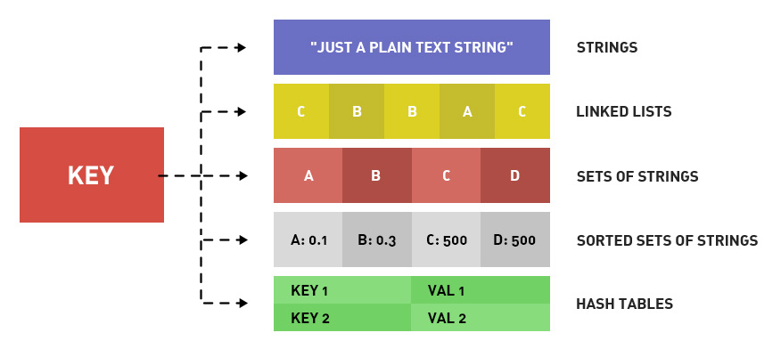
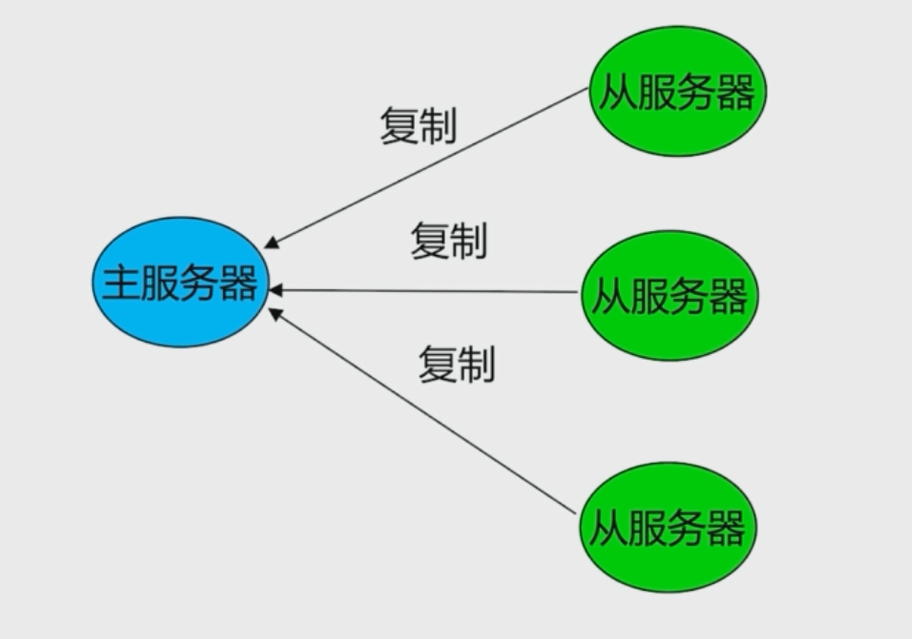
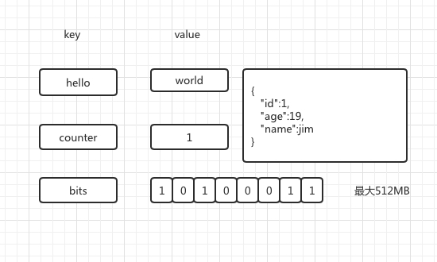
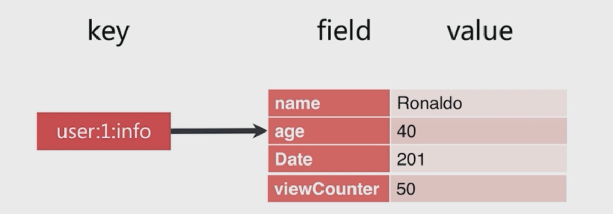
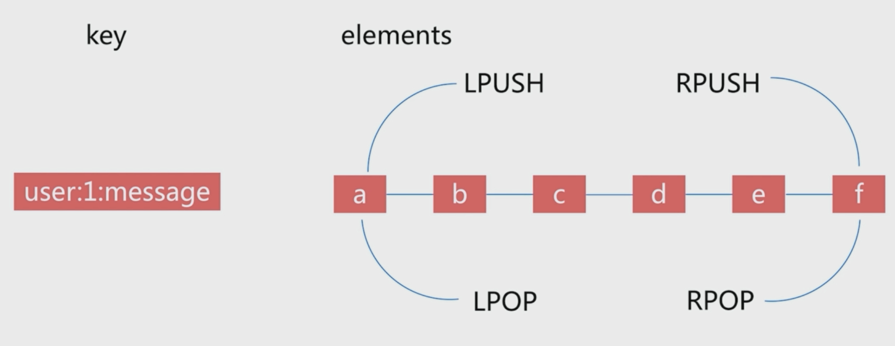
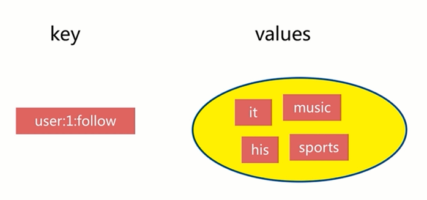
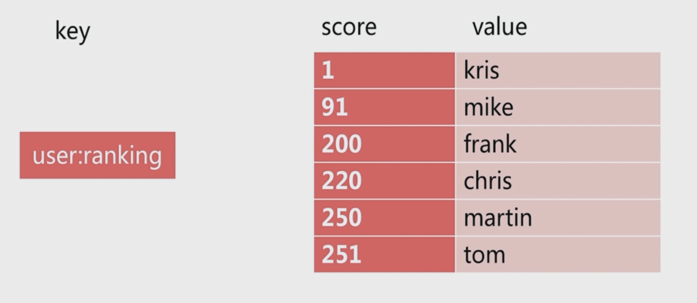

title: Redis 入门
speaker: Tony Zheng

<slide />

# Redis

Tony Zheng

<slide />

## Redis 简介

Redis 是由 C 语言编写的开源、基于内存、支持多种数据结构、高性能的 Key-Value 数据库。

<slide />

## 特性

- 速度快
- 持久化
- 多种数据结构
- 多语言客户端
- 功能丰富
- 主从复制
- 高可用和集群

<slide />

## 速度快

首先 Redis 是将数据储存在内存中的，通常情况下每秒读写次数达到千万级别。其次 Redis 使用 ANSI C 编写，因为 C 语言接近操作系统，所以 Redis 的执行效率很高。最后 Redis 的处理网络请求部分采用的是单线程，如果想充分利用 CPU 资源的话，可以多开几个 Redis 实例来达到目的，为什么单线程还是速度快的原因呢？我们知道 Redis 的读写都是基于内存的，读写速度都是非常快的，不会出现需要等待很长时间，所以瓶颈并不会出现在请求读写上，所以没必要使用多线程来利用 CPU，如果使用多线程的话（线程数 > CPU数情况下），多线程的创建、销毁、线程切换、线程竞争等开销所需要的时间会比执行读写所损耗的时间还多，那就南辕北辙了，当然这是在数据量小的时候才会这样，如果数据量到达一定量级了，那肯定是多线程比单线程快（线程数 <= CPU 数情况下）。

<slide />

## 持久化

Redis 可以通过 RDB 和 AOF 两种方式将数据持久化到磁盘上，其中这两种方式的区别如下：

- `RDB`(Redis Database)：是在指定的时间间隔内将内存中的数据通过异步生成数据快照并且保存到磁盘中。
- `AOF`(Append Of File)：相对于 RDB 方式，AOF 方式的持久化更细粒度，把每次数据变化（写、删除操作）都记录 AOF 文件中，其中 AOF 又可以配置为 `always` 即实时将记录写到 AOF 文件中，`everysec` 每隔一秒将记录写到 AOF 文件中，`no` 由系统决定何时将记录写到AOF文件中。

<slide />

## 多种数据结构

Redis支持五种基本的数据结构，分别是 String（字符串）、Hash（哈希）、List（列表）、Set（集合）、Zset（即 Sorted Set 有序集合），这些数据结构类型和我们使用的开发语言的数据结构类型其实是相对应的。

<slide />

## 多语言客户端

Redis支持多种语言，诸如 Ruby, Python, Twisted Python, PHP, Erlang, Tcl, Perl, Lua, Java, Scala, Clojure 等。

<slide />

## 功能丰富

Redis支持发布订阅、Lua 脚本、事务、Pipeline 等功能。

- pipeline：https://blog.csdn.net/u011489043/article/details/78769428

<slide />

## 主从复制

在 Redis 中，用户可以通过执行 SLAVEOF 命令或者 SLAVEOF 选项，让从服务器去复制主服务器，为高可用和分布式提供了基础。

<slide />

## 高可用和集群

- 高可用：有了主从复制之后的实现之后，如果想对服务器进行监控，那么在 Redis2.6 以后提供了一个Sentinel（哨兵机制）。顾名思义，哨兵的含义就是监控 Redis 系统的运行状态，可以启动多个哨兵，去监控 Redis 数据库的运行状态。其功能有以下两点：
    - 监控所有节点数据库是否正常运行
    - 主数据库出现故障时，可以通过自动投票机制，在从数据库选举出新的主数据库，实现将从数据库转为主数据库的自动切换
- 集群：Redis在 3.0 版本正式引入了 Redis-Cluster 集群这个特征。Redis-Cluster 采用无中心架构，每个节点保存完整的数据和整个集群的状态，每个节点都和其他所有节点连接。

<slide />

## redis.conf 配置项

https://www.runoob.com/redis/redis-conf.html

<slide />

## 通用命令

- KEYS [pattern]：符合给定模式的 key 列表。
- DBSIZE：返回当前数据库的 key 的数量。
- EXISTS key： key 存在，返回 1，不存在返回 0。
- DEL key [key...]：删除 key。
- EXPIRE key seconds：设置成功返回 1，当 key 不存在或者设置失败的时候返回 0。
- PERSIST key：当生存时间移除成功时，返回 1，如果 key 不存在或者没有设置生存时间，返回 0。
- TTL key：当 key 不存在时，返回 -2，当 key 存在但是没有设置生存时间时，返回 -1，否则返回 key 的剩余生存时间。

<slide />

## 数据结构 - String

- 字符串是 Redis 中最基础的数据结构。
- 字符串的值虽然是字符串但是可以保存很多种类型的数据，如：简单的字符串、JSON、XML、数字、二进制等。需要注意一点的是，Redis中字符串类型的值最大能保存512MB。
- 命令
    - SET key value
    - GET key
    - DEL key

<slide />

## 数据结构 - Hash

<slide />

## 数据结构 - List

<slide />

## 数据结构 - Set

<slide />

## 数据结构 - Sorted Set

<slide />

## 应用场景

- String：适合最简单的 k-v 存储，类似于 memcached 的存储结构，短信验证码，配置信息等，就用这种类型来存储。
- Hash：一般key为ID或者唯一标示，value对应的就是详情了。如商品详情，个人信息详情，新闻详情等。
- List：因为 list 是有序的，比较适合存储一些有序且数据相对固定的数据。如省市区表、字典表等。因为list是有序的，适合根据写入的时间来排序，如：最新的***，消息队列等。
- Set：可以简单的理解为 ID-List 的模式，如微博中一个人有哪些好友，set最牛的地方在于，可以对两个 set 提供交集、并集、差集操作。例如：查找两个人共同的好友等。
- Sorted Set：是set的增强版本，增加了一个 score 参数，自动会根据 score 的值进行排序。比较适合类似于 top 10 等不根据插入的时间来排序的数据。

<slide />

## 参考资料

- 官网：https://redis.io/
- Redis Command 简体中文翻译版：https://redis.readthedocs.io/en/2.6/index.html
