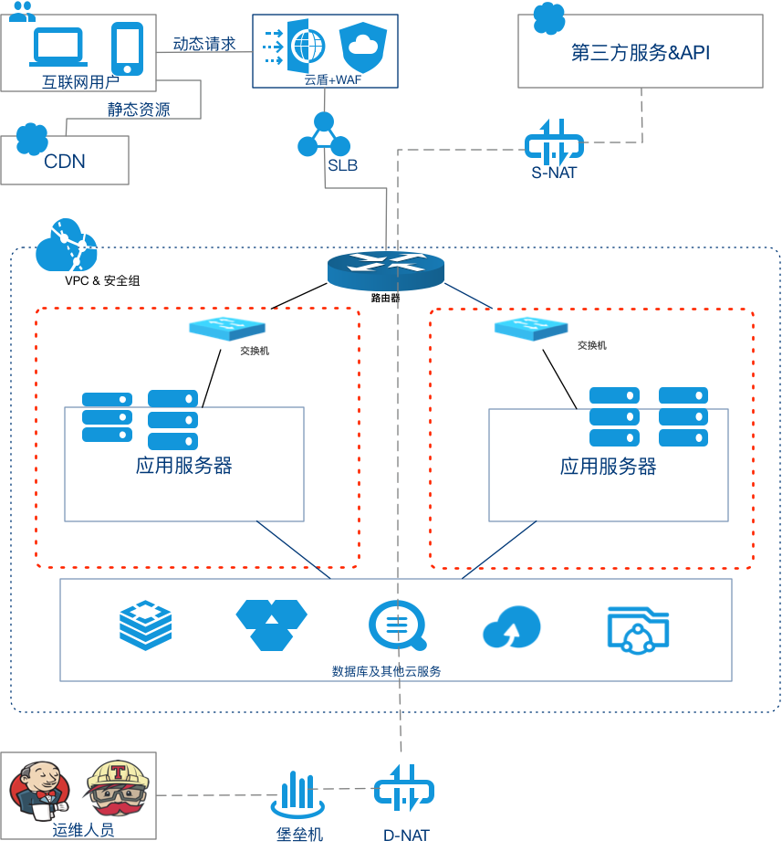

title: 阿里云
speaker: Jerome Ge

<slide />

# 阿里云

Jerome Ge

<slide />

## 常用服务

- VPC：虚拟专有网络，与公网默认隔离，可以在专用网络内创建和管理云产品实例，如 ECS 、RDS 等。
- NAT：公网网关，为 VPC 内的资源提供网络转发功能，有 DNAT 用 VPC 内的服务器面向公网提供服务和 SNAT 用于对云服务器提供对外统一的 IP 网关两种功能。
- EIP：弹性公网IP，可绑定到 ECS、NAT、SLB 等提供公网访问能力。
- ECS：一种简单高效、处理能力强的云服务器。
- RDS：阿里关系型数据库，支持 MySQL、SQL Server 等。
- 云数据库Redis：兼容开源 Redis 协议的 KV 类型在线存储服务。
- 云数据库MongoDB：完全兼容 MongoDB 协议的非关系型数据库，提供三节点副本集的高可用架构。
- DMS：支持 MySQL、SQL Server、PostgreSQL 关系型数据库和MongoDB、Redis 非关系型数据库的管理服务和操作审计功能。
- DTS：支持 MySQL、SQL Server、PostgreSQL、Oracle、MongoDB、Redis 数据库的迁移及实时增量同步服务。

<slide />

## 常用服务

- NAS：面向 ECS 提供的文件存储服务，支持标准的 NFS 和 SMB 文件访问协议。
- OSS：海量、安全、低成本、高可靠的对象存储服务。
- SLS：日志服务，快捷的数据采集、加工、查询与分析、消费与投递等功能，帮忙提升运维、运营效率。
- SLB：对多台云服务器进行流量分发的负载均衡业务。
- CDN：缓存 Web 应用的静态资源到内容分发网络（CDN）,由分布在不同区域的 CDN 节点代替 Web 应用服务器为用户返回请求资源。
- WAF：Web 应用防火墙，提供 SQL 注入、XSS 跨站脚本、常见 Web 服务器插件漏洞、木马上传、非授权核心资源访问等 OWASP 常见攻击防御，过滤海量恶意CC攻击，避免您的网站资产数据泄露，保障网站的安全与可用性。
- RAM：访问控制，是阿里云提供的一项管理用户身份与资源访问权限的服务，可在一个主账号下创建不同的子账号，授予不同的权限。
- 堡垒机：对 ECS 的所有操作都需要经过堡垒机，堡垒机具有身份鉴别、账号管控、系统操作审计等多种功能。通过正向代理的方式实现对 SSH 、Windows 远程桌面、及 SFTP 等常见运维协议的数据流进行全程记录，并通过协议数据流重组的方式进行录像回放，达到运维审计的目的。
- 云安全中心：是一个实时识别、分析、预警安全威胁的统一安全管理系统，通过漏洞扫描、防勒索、防病毒、防篡改、镜像安全扫描、合规检查等安全能力，帮助您实现威胁检测、响应、溯源的自动化安全运营闭环，保护云上资产和本地服务器并满足监管合规要求。
- 云监控：针对阿里云资源和互联网应用进行监控的服务。云监控服务可用于收集获取阿里云资源的监控指标，探测互联网服务可用性，以及针对指标设置警报。

<slide />

### VPC

[文档](https://help.aliyun.com/product/27706.html?spm=a2c4g.11186623.6.540.d2cf1753EOskhq)

阅读以下章节：

- 产品简介
- 快速入门
- 专有网络和交换机
- 网络连接
- 访问控制

<slide />

### NAT

[文档](https://help.aliyun.com/product/44413.html?spm=a2c4g.11174283.6.540.18607d2e34WXIS)

阅读以下章节：

- 产品简介
- 快速入门
- 基本功能操作
- 最佳实践

<slide />

### EIP

[文档](https://help.aliyun.com/product/61789.html?spm=a2c4g.11186623.6.540.6e6b1b6csQV2Ep)

阅读以下章节：

- 什么是弹性公网IP
- 用户指南

<slide />

### ECS

[文档](https://help.aliyun.com/product/25365.html?spm=a2c4g.750001.list.2.56417b13snhp6g)

阅读以下章节：

- 产品简介
- 快速入门
- 实例
- 镜像
- 块存储
- 快照
- 安全
- 网络

<slide />

<slide />

### 云数据库 Redis

[文档](https://help.aliyun.com/product/26340.html?spm=a2c4g.750001.list.47.56417b13snhp6g)

阅读以下章节：

- 产品简介
- 快速入门
- 用户指南

<slide />

### 云数据库 MongoDB

[文档](https://help.aliyun.com/product/26556.html?spm=a2c4g.750001.list.48.56417b13snhp6g)

阅读以下章节：

- 产品简介
- 快速入门
- 基本功能操作
- 用户指南

<slide />

### DTS

[文档](https://help.aliyun.com/product/26590.html?spm=a2c4g.750001.list.59.56417b13snhp6g)

阅读以下章节：

- 产品简介
- 快速入门
- 数据迁移

<slide />

### NAS

[文档](https://help.aliyun.com/product/27516.html?spm=a2c4g.750001.list.24.56417b13snhp6g)

阅读以下章节：

- 产品简介
- 规格类型
- 快速入门
- 挂载访问

<slide />

### OSS

[文档](https://help.aliyun.com/product/31815.html?spm=a2c4g.750001.list.22.56417b13snhp6g)

阅读以下章节：

- 产品简介
- 快速入门
- 开发指南
- 控制台用户指南

### SLS

[文档](https://help.aliyun.com/product/28958.html?spm=a2c4g.750001.list.23.56417b13snhp6g)

阅读以下章节：

- 产品简介
- 快速入门
- 数据采集
- 查询与分析

<slide />

### SLB

[文档](https://help.aliyun.com/product/27537.html?spm=a2c4g.750001.list.142.56417b13snhp6g)

阅读以下章节：

- 传统型负载均衡 CLB
    - CLB 产品简介
    - CLB 快速入门
    - CLb 用户指南

<slide />

### CDN

[文档](https://help.aliyun.com/product/27099.html?spm=a2c4g.750001.list.152.56417b13snhp6g)

阅读以下章节：

- 产品简介
- 快速入门
- 域名管理
- 服务管理

<slide />

### WAF

[文档](https://help.aliyun.com/product/28515.html?spm=a2c4g.750001.list.70.56417b13snhp6g)

阅读以下章节：

- 产品简介
- 快速入门
- WAF 总览
- WAF 安全报表
- 接入 WAF
- 网站防护配置

<slide />

### RAM

[文档](https://help.aliyun.com/product/28625.html?spm=a2c4g.11186623.6.540.59f61f009NfVFv)

阅读以下章节：

- 产品简介
- 快速入门
- 用户管理
- 用户组管理
- 角色管理
- 权限策略管理
- 教程

<slide />

### 堡垒机

[文档](https://help.aliyun.com/product/52862.html?spm=a2c4g.11174283.6.540.188d63926Z1kNY)

阅读以下章节：

- 产品简介
- 快速入门
    - V2 版本
- 用户指南 V2 版本

<slide />

### 云安全中心

[文档](https://help.aliyun.com/product/28498.html?spm=a2c4g.750001.list.72.56417b13snhp6g)

阅读以下章节：

- 产品简介
- 快速入门
- 接入云安全中心
- 主动防御
- 安全防范
- 威胁检测

<slide />

### 云监控

[文档](https://help.aliyun.com/product/28572.html?spm=a2c4g.11174283.6.540.2f248f4fEvS8Bq)

阅读以下章节：

- 产品简介
- 快速入门
- 应用分组
- 主机监控
- 站点监控
- 报警服务

<slide />

### 架构图

<slide />

### 规范

[云操作规范](https://kb.maiscrm.com/sre/cloudOpsSpec.html#%E9%98%BF%E9%87%8C%E4%BA%91)
