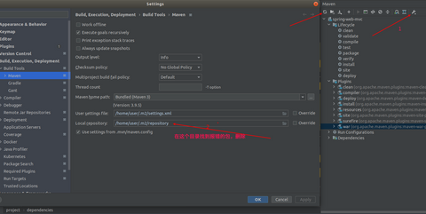

# 遇到的问题

#### maven项目报错Cannot resolve plugin org.apache.maven.plugins:maven-war-plugin:2.2

如果IDEA整合maven没有问题，还是报这个错误，很大可能是由于在下载过程中存在网络问题，导致文件下载一半而停止，但是已经在仓库中存在这个文件夹，解决方法是删除文件夹重新下载即可。

删除本地仓库下的\org\apache\maven\plugins\maven-war-plugin\2.2文件夹重新下载

