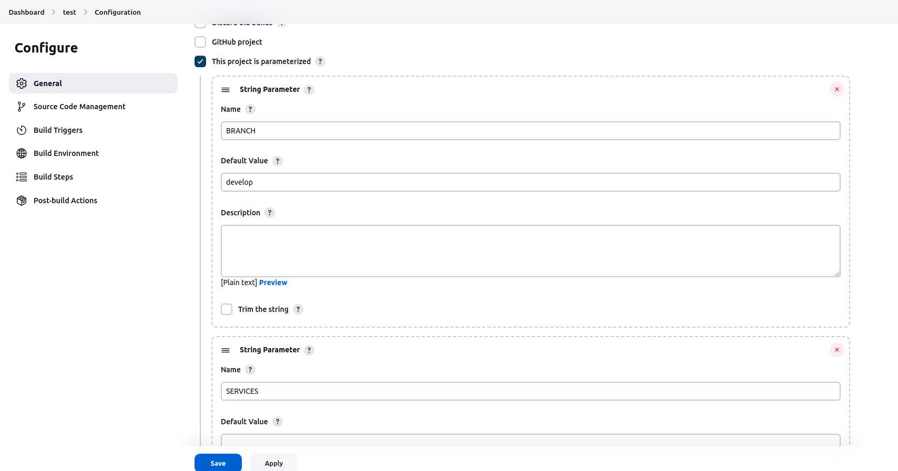
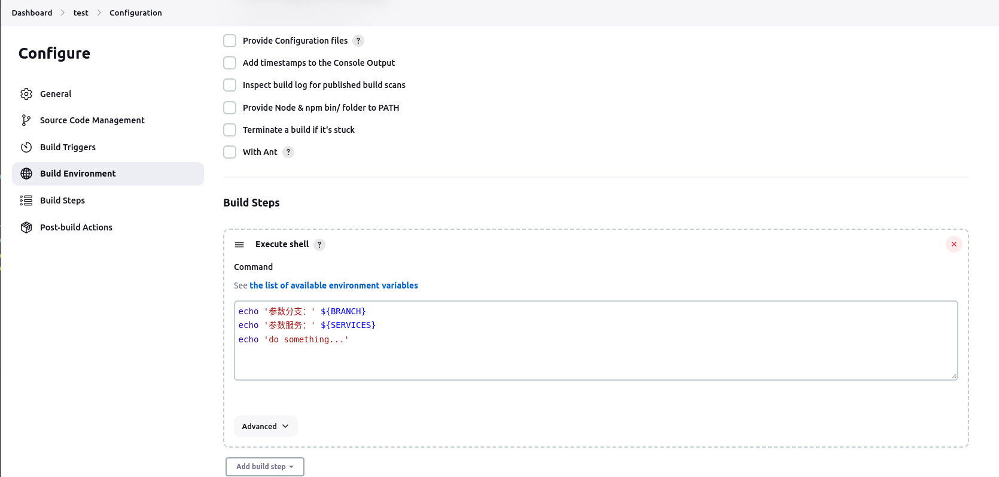
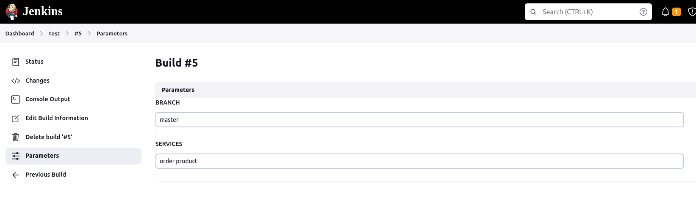
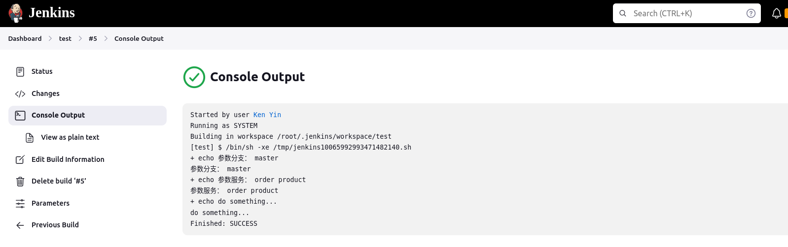

# 自动部署

## jenkins + GitHub 实现项目自动化部署

### 安装jenkins

[https://www.jenkins.io/zh/doc/pipeline/tour/getting-started/#下载并运行-jenkins](https://www.jenkins.io/zh/doc/pipeline/tour/getting-started/#%E4%B8%8B%E8%BD%BD%E5%B9%B6%E8%BF%90%E8%A1%8C-jenkins)

### 启动jenkins

```shell
java -jar jenkins.war --httpPort=8080
```

参考：

- [Jenkins 系列教程-史上最简单Jenkins教程，教你一天学会使用Jenkins利器](https://blog.csdn.net/qq_32352777/article/details/109267847)
- [jenkins部署go程序(自动编译部署)](https://juejin.cn/post/6952765925388976165)
- [jenkins + GitHub 实现项目自动化部署](https://learnku.com/articles/44764)

:::tip
在配置项目时候 Source Code Management 中 Git 的 Credentials 配置老是失败，还没找到原因，解决办法是在服务器生成 ssh key 添加到了 github，然后就 Credentials 就选择了 none
:::

## jenkins执行脚本npm: command not found解决

- [https://blog.csdn.net/u011296165/article/details/96110294](https://blog.csdn.net/u011296165/article/details/96110294)

## 如何使用 REST API 和 cURL 构建作业？

:::tip
可用于 gitlab ci 之后执行脚本自动部署项目。
:::

- 示例构建：

```shell
curl --user USER:API_TOKEN -X POST https://localhost:8080/job/test/build
```

代替：

`USER:API_TOKEN` 使用您的用户名和 API 令牌

`localhost:8080` 你的 Jenkins URL

`test` 你的工作名称

- 使用字符串参数构建示例：

```shell
curl --user USER:API_TOKEN -X POST https://localhost:8080/job/test/build --data-urlencode json='{"parameter": [{"name":"paramA", "value":"123"}]}'
```

代替：

`USER:API_TOKEN` 使用您的用户名和 API 令牌

`localhost:8080` 你的 Jenkins URL

`test` 你的工作名称

`paramA` 你的参数名称

`123` 你的参数值

### 我的实践：

- 添加参数：



- 添加 shell 脚本



- 调用 api:

```shell
curl -X POST http://jenkins.get123.xyz/job/test/build \
    --user myUser:xxxxxxxxx \
    --data-urlencode json='{"parameter": [{"name":"BRANCH", "value":"master"},{"name":"SERVICES", "value":"order product"}]}'
```

- 查看参数：



- 查看输出：


