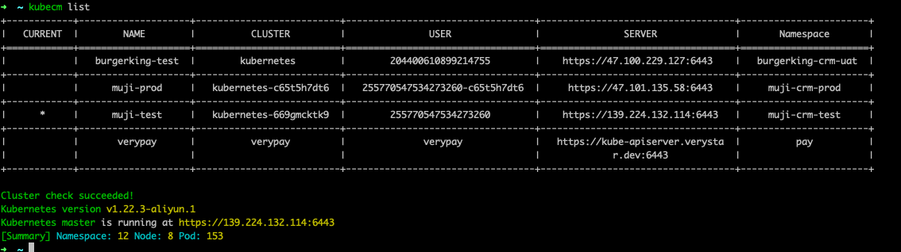

## KubeCm

官网：[https://kubecm.cloud/](https://kubecm.cloud/)

- 从阿里云集群中复制连接信息


文件 `$HOME/.kube/muji-crm-test.yml`
```yaml
apiVersion: v1
clusters:
- cluster:
    server: https://139.224.132.114:6443
    certificate-authority-data: xxxxx=
  name: kubernetes
contexts:
- context:
    cluster: kubernetes
    user: "255770547534273260"
    namespace: muji-crm-test # 这里自己添加上的
  name: muji-test # 这里我自己改了名字，方便使用 kebecm 时查看名字和切换集群
current-context: muji-test # 这里也是改了
kind: Config
preferences: {}
users:
- name: "255770547534273260"
  user:
    client-certificate-data: xxxxxxx
    client-key-data: xxxxx==
```

- 添加集群信息

```shell
kubecm add -f $HOME/.kube/muji-crm-test.yml

# 提示是否 overwrite，是否覆盖，选择true是会合并信息，不会被替换
# 然后选择 True 会把信息合并到 $HOME/.kube/config 中
```

- 查看有哪些集群信息

```shell
kubecm list
```



- 切换集群

```shell
kubecm s muji-test
```