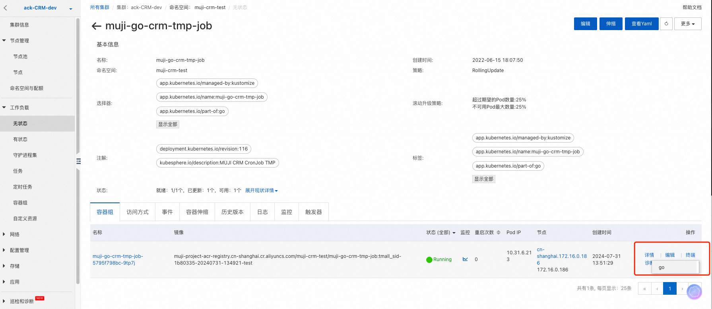

# kubectl

## 安装

[https://kubernetes.io/zh-cn/docs/tasks/tools/install-kubectl-linux/](https://kubernetes.io/zh-cn/docs/tasks/tools/install-kubectl-linux/)

```
curl -LO https://dl.k8s.io/release/v1.18.0/bin/linux/amd64/kubectl
```

或者在浏览器地址栏输入 `https://dl.k8s.io/release/v1.18.0/bin/linux/amd64/kubectl`

:::tip
注意版本和 k8s 的版本上下不要相差 1

Before you begin
You must use a kubectl version that is within one minor version difference of your cluster. For example, a v1.28 client can communicate with v1.27, v1.28, and v1.29 control planes. Using the latest compatible version of kubectl helps avoid unforeseen issues.
:::

版本对应关系：[https://github.com/kubernetes-sigs/kind/releases?page=2](https://github.com/kubernetes-sigs/kind/releases?page=2)

## 使用

- 查看版本

```shell
# 客户端版本
kubectl version --client

# 客户端和服务端版本
kubectl version
```

- 查看集群信息

```shell
kubectl cluster-info
```

## 常用命令

```shell
# 部署应用
kubectl apply -f app.yaml
# 查看 deployment
kubectl get deployment
# 查看 pod
kubectl get pod -o wide
# 查看 pod 详情
kubectl describe pod pod-name
# 查看 log
kubectl logs pod-name
# 进入 Pod 容器终端， -c container-name 可以指定进入哪个容器。
kubectl exec -it pod-name -- bash
# 伸缩扩展副本
kubectl scale deployment test-k8s --replicas=5
# 把集群内端口映射到节点
kubectl port-forward pod-name 8090:8080
# 查看历史
kubectl rollout history deployment test-k8s
# 回到上个版本
kubectl rollout undo deployment test-k8s
# 回到指定版本
kubectl rollout undo deployment test-k8s --to-revision=2
# 删除部署
kubectl delete deployment test-k8s
# 进入 pod 中的容器
kubectl exec -it pod-name -c container-name -- bash
# 删除所有服务
kubectl delete all --all
# 查看 pods 默认是查看 default 命名空间的 pods
kubectl get pods
# 查看指定命名空间的 pods
kubectl get pods -n namespace
# 删除某个命名空间的 pods
kubectl delete pods --all -n <namespace>

# 执行命令
kubectl exec -it muji-go-crm-tmp-job-5795f798bc-9tp7j -- /bin/sh -c "ls"

# 开两个窗口一个执行这个命令，另一个执行 kubectl log -f pod-name 查看日志可以看到输出 aaa
kubectl exec -it muji-go-crm-tmp-job-5795f798bc-9tp7j -- /bin/sh -c "echo aaa 2>&1 | tee /proc/1/fd/1"
```

- 本地文件复制到pod中

```shell
kubectl cp <local-file-or-directory> <namespace>/<pod-name>:<container-path>
# 例如
kubectl cp gen_mobile_13000000000_to_13999999999_202407310950.csv muji-go-crm-tmp-job-5795f798bc-9tp7j:/app
```

- 复制pod种文件到本地

```shell
kubectl cp <namespace>/<pod-name>:<container-path> <local-file-or-directory>
# 例如
kubectl cp muji-go-crm-tmp-job-5795f798bc-9tp7j:/app/gen_mobile_13000000000_to_13999999999_202407310950.csv ./gen_mobile_13000000000_to_13999999999_202407310950.csv
```

:::tip
在 Kubernetes 中，当你手动进入 Pod 并执行命令时，这些命令的输出通常不会被重定向到容器的标准输出或标准错误，因此 kubectl logs 无法捕获这些日志。不过，有一些方法可以让你在手动执行命令时，也能将日志输出到 kubectl logs 可以捕获的地方。
:::

- 使用 kubectl exec 结合重定向

你可以使用 kubectl exec 来在容器内执行命令，并将输出重定向到标准输出或标准错误。这样，kubectl logs 可以捕获这些日志。

```shell
kubectl exec -it <pod-name> -- /bin/sh -c "./app temp generate_mobile --env=test --tableName=mobile_tmall1 --worker=10 --num=200 --minMobile=13499999999 --maxMobile=13999999999 2>&1 | tee /proc/1/fd/1"
```

- 启动一个临时容器并输出到标准输出

可以创建一个临时 Pod 或容器，专门用于执行你需要的命令，并确保输出到标准输出。

临时 Pod 示例

创建一个临时 Pod 配置文件 temp-job.yaml：
```yaml
apiVersion: batch/v1
kind: Job
metadata:
  name: temp-job
spec:
  template:
    spec:
      containers:
      - name: temp-job-container
        image: your-image
        command: ["/bin/sh", "-c"]
        args: ["./app temp generate_mobile --env=test --tableName=mobile_tmall1 --worker=10 --num=200 --minMobile=13499999999 --maxMobile=13999999999"]
      restartPolicy: Never
```
应用这个配置：
```shell
kubectl apply -f temp-job.yaml
```
然后你可以查看这个临时 Pod 的日志：
```shell
kubectl logs -f job/temp-job
```

- 可以通过创建临时 Pod

具体示例

假设你有一个简单的 Go 程序 app.go，内容如下：
```go
package main

import (
	"log"
	"time"
)

func main() {
	log.Println("生成手机号任务开始")
	log.Printf("开始时间: %s\n", time.Now().Format(time.RFC3339Nano))
	// 模拟工作
	time.Sleep(10 * time.Second)
	log.Println("生成手机号任务结束")
}
```
Dockerfile:
```shell
FROM golang:1.18-alpine
WORKDIR /app
COPY app.go .
RUN go build -o app .
CMD ["sh", "-c", "tail -f /dev/null"]
```
部署Pod:
```yaml
apiVersion: v1
kind: Pod
metadata:
  name: muji-go-crm-temp-job
spec:
  containers:
  - name: muji-go-crm-temp-job-container
    image: your-image:latest
    command: ["sh", "-c", "tail -f /dev/null"]  # 让容器保持运行
```
然后使用 kubectl exec 在 Pod 内执行命令并重定向输出：

```shell
kubectl exec -it muji-go-crm-temp-job -- /bin/sh -c "./app temp generate_mobile --env=test --tableName=mobile_tmall1 --worker=10 --num=200 --minMobile=13499999999 --maxMobile=13999999999 2>&1 | tee /proc/1/fd/1"
```
为了确保手动执行命令的日志能够被 kubectl logs 捕获，最简单的方法是使用 kubectl exec 结合重定向，将日志输出到标准输出或标准错误。此外，你也可以通过创建临时 Pod 或使用日志收集工具来实现这一目标。

- 直接在pod中执行并重定向



进入阿里云k8s集群，进入pod执行：
```shell
./app temp generate_mobile --env=test --tableName=mobile_tmall1 --worker=10 --num=200 --minMobile=13000000000 --maxMobile=13000000099 2>&1 | tee /proc/1/fd/1
```