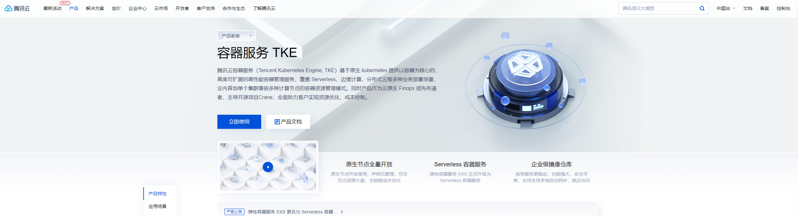
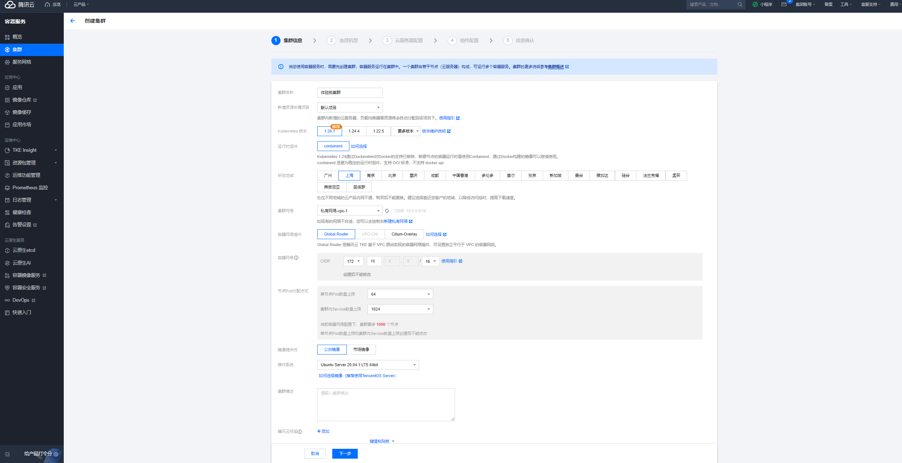
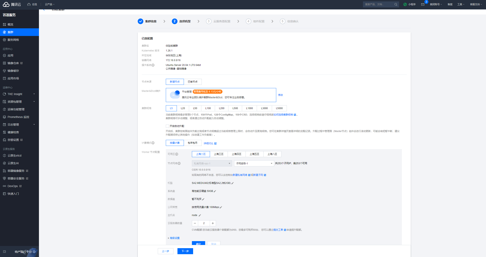
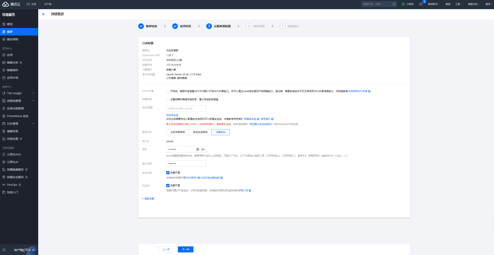
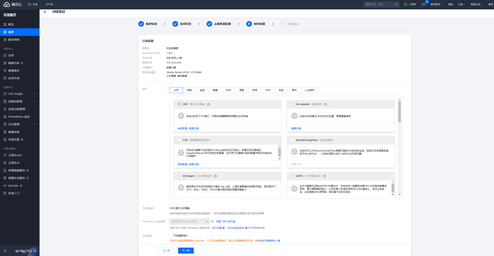

# 腾讯云

## k8s 集群

- 容器服务 TKE



- 创建集群



- 选择机型



- 云服务器配置



- 组件配置



- 完成创建

- 开启允许外网访问。

- 下载 kubeconfig

重命名

```shell
mv ~/Downloads/cli-f5ukhgwj-config ~/Downloads/qcloud-config
```

- 新开终端

```shell
export KUBECONFIG=~/Downloads/qcloud-config
```

再查看集群信息：

```shell
kubectl cluster-info
```

此时显示的是跑在腾讯云机器上的集群。

- 可以使用 vscode 插件管理集群

管理腾讯云的： 点击插件设置选中 ~/Downloads/qcloud-config

管理本地 Kind 的：

```shell
kind get kubeconfig > ~/Downloads/kind-config
```

然后点击插件设置选中 ~/Downloads/kind-config


:::tip
Kubernetes（K8s）中的 Service 是一种用于公开应用程序的方法，它可以将流量路由到运行应用程序的 Pod。NodePort 和 Port-Forward 是两种不同的方法，用于访问 K8s Service 中的应用程序，它们有以下区别：

1.NodePort：


- 端口公开性：NodePort 允许你将 Service 暴露到集群中每个节点的指定端口上。这意味着可以通过集群中的任何节点的 IP 地址和 NodePort 端口来访问 Service。
- 适用场景：NodePort 通常用于在集群外部或跨集群访问 Service，例如，当你希望从外部网络或另一个集群中的 Pod 访问 Service 时。它通常不用于本地开发或调试目的。

2.Port-Forward：

- 端口公开性：Port-Forward 通常用于在本地工作站上暴露 Service 中的 Pod。它会将本地端口与远程 Pod 的端口建立映射，只有本地访问才能访问 Service。
- 适用场景：Port-Forward 用于本地开发和调试，允许开发人员直接访问 Service 中的 Pod，以便进行调试、测试和开发。

总结一下，NodePort 用于在集群外部或跨集群访问 Service，而 Port-Forward 用于在本地开发环境中访问 Service 中的 Pod。它们各自适用于不同的使用情况和需求，因此选择使用哪种方法取决于你的具体目标。**所以如果在 tencent 机器的终端使用 port-forward 后在自己的电脑访问该端口会不成功，在 tencent 机器访问端口成功。**
:::