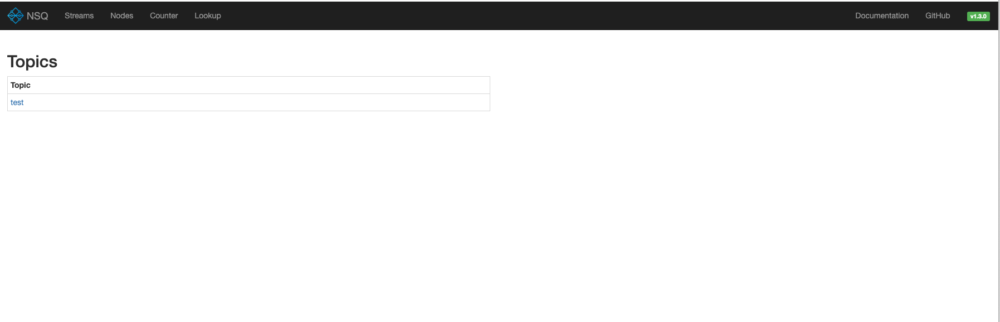
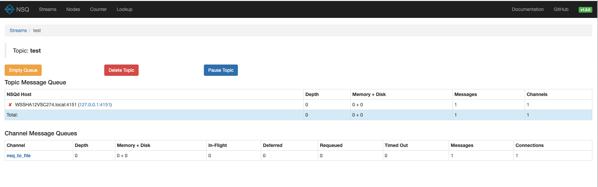
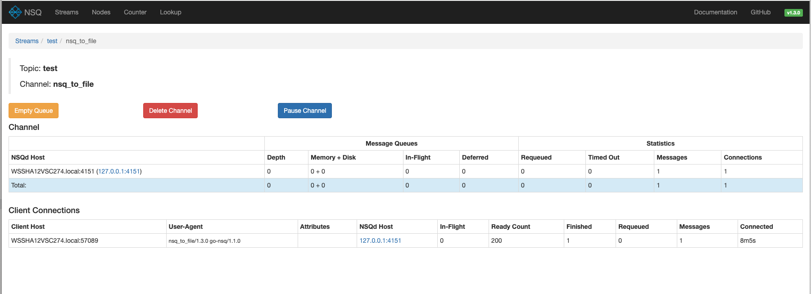

# NSQ

## 安装

- mac安装

```shell
brew install nsq
```

## 使用

### 开始

- 分别在几个shell中执行

```shell
nsqlookupd

nsqd --lookupd-tcp-address=127.0.0.1:4160

# 管理后台
nsqadmin --lookupd-http-address=127.0.0.1:4161

# 发送一个初始消息
curl -d 'hello world 1' 'http://127.0.0.1:4151/pub?topic=test'

# 如果执行这个报错 error connecting to nsqd - dial tcp: lookup WSSHA12VSC274.local: i/o timeout，需要在执行
# nsqd --lookupd-tcp-address=127.0.0.1:4160 的时候加上 --broadcast-address=127.0.0.1
# 例如： nsqd --lookupd-tcp-address=127.0.0.1:4160 --broadcast-address=127.0.0.1
nsq_to_file --topic=test --output-dir=/tmp --lookupd-http-address=127.0.0.1:4161

# 发送更多消息
curl -d 'hello world 2' 'http://127.0.0.1:4151/pub?topic=test'
```

- 查看`/tmp`中的`test.*.log`文件

```shell
cat /tmp/test.WSSHA12VSC274.2024-08-07_10.log
# 显示内容
hello world 1
hello world 1
hello world 2
hello world 3
hello world 1
hello world 2
hello world 哈哈
```

- 打开后台

[http://127.0.0.1:4171/](http://127.0.0.1:4171/)








## 相关资料

- 官网 [https://nsq.io/](https://nsq.io/)
- [https://www.liwenzhou.com/posts/Go/nsq/](https://www.liwenzhou.com/posts/Go/nsq/)