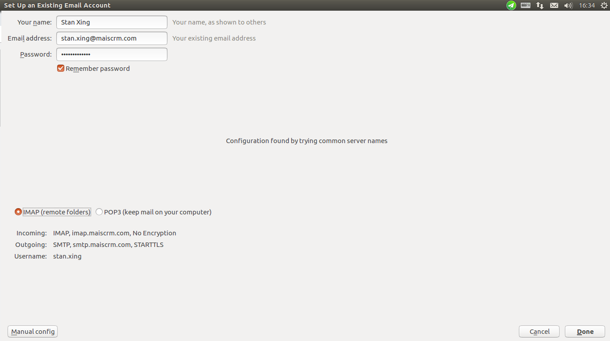
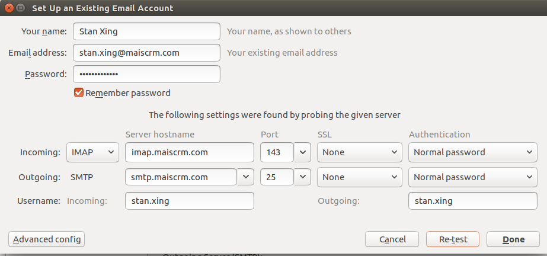
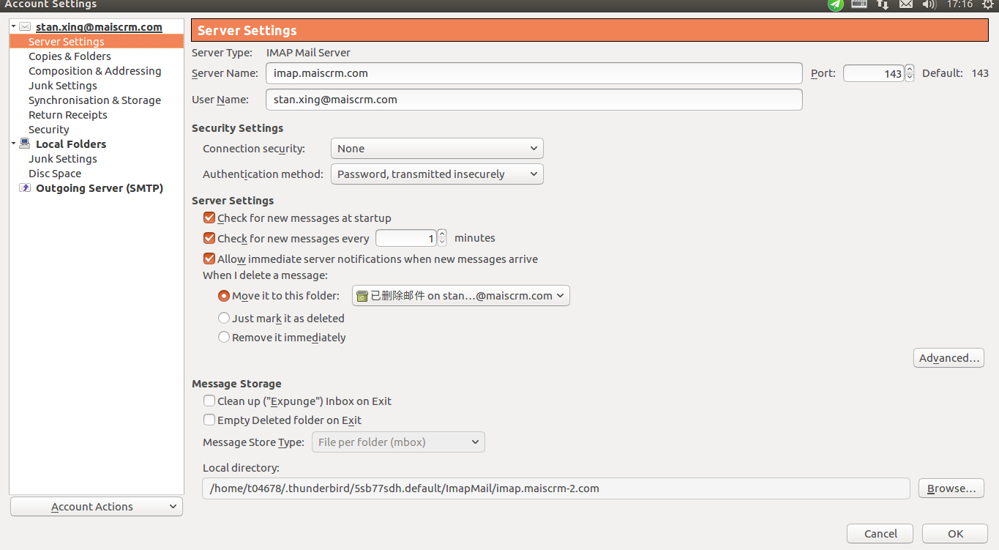
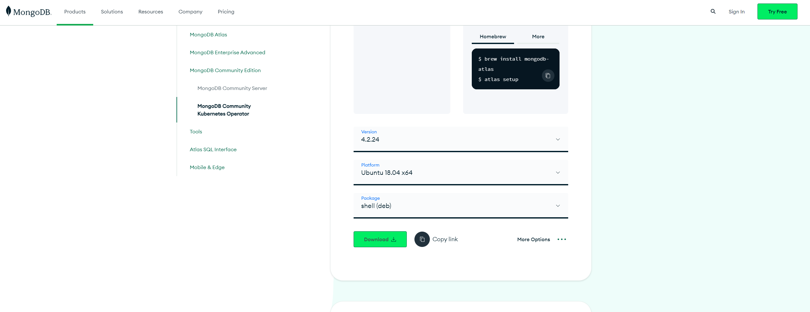
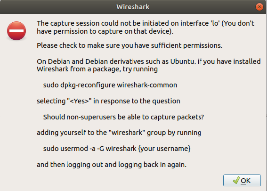

# Ubuntu18.04 系统开发环境配置

## 解决GitHub的raw.githubusercontent.com无法连接问题

Connecting to raw.githubusercontent.com (raw.githubusercontent.com)|0.0.0.0|:443... failed: Connection refused.

在 [https://site.ip138.com/raw.Githubusercontent.com/](https://site.ip138.com/raw.Githubusercontent.com/)

输入`raw.githubusercontent.com`查询IP地址

修改hosts Ubuntu:

```shell
sudo vim /etc/hosts
```

```shell
# GitHub Start
52.74.223.119 github.com
192.30.253.119 gist.github.com
54.169.195.247 api.github.com
185.199.111.153 assets-cdn.github.com
151.101.76.133 raw.githubusercontent.com
151.101.108.133 user-images.githubusercontent.com
151.101.76.133 gist.githubusercontent.com
151.101.76.133 cloud.githubusercontent.com
151.101.76.133 camo.githubusercontent.com
151.101.76.133 avatars0.githubusercontent.com
151.101.76.133 avatars1.githubusercontent.com
151.101.76.133 avatars2.githubusercontent.com
151.101.76.133 avatars3.githubusercontent.com
151.101.76.133 avatars4.githubusercontent.com
151.101.76.133 avatars5.githubusercontent.com
151.101.76.133 avatars6.githubusercontent.com
151.101.76.133 avatars7.githubusercontent.com
151.101.76.133 avatars8.githubusercontent.com
# GitHub End
```

## github 无法访问问题

使用 `git pull` 报错：

ssh: connect to host github.com port 22: Operation timed out fatal: 无法读取远程仓库。

1. `ping github.com` 无法ping通

2. `nslookup github.com 1.1.1.1` 拿到github的真是ip

```text
Server:         1.1.1.1
Address:        1.1.1.1#53

Non-authoritative answer:
Name:   github.com
Address: 192.30.255.113
```

3. 修改 hosts

```text
sudo vim /etc/hosts

192.30.255.113 github.com
```

4. 再次 `ping github.com` ping通

## 代理

```shell
#! /bin/bash -e

main() {
    trap 'onCtrlC' INT
    function onCtrlC () {
        echo -e '\nCtrl+C is captured'
        gsettings set org.gnome.system.proxy mode 'none'
    }
    gsettings set org.gnome.system.proxy mode 'manual'
    sshpass -p ${墙外服务器密码} -ND 1080 root@${墙外服务器ip}
}

main
```

## 搜狗输入法安装

:::tip
我的是 Win11 + Ubuntu18.04双系统
如果按照按照官网的教程直接安装，大概率安装好以后是无法使用的，可尝试如下方法修复。虚拟机或 Ubuntu 单系统也可参考。
:::

- 先卸载掉fcitx，及其所有相关的软件。

```shell
sudo apt -y --purge remove fcitx
sudo apt clean fcitx
```

- 然后安装一些依赖。

```shell
sudo apt -y install fcitx fcitx-bin fcitx-table fcitx-table-all
sudo apt -y install fcitx-config-gtk
sudo apt -y install fcitx-libs libfcitx-qt0 libopencc2 libopencc2-data libqt4-opengl libqtwebkit4
```

- 下载搜狗拼音。

:::tip
只能下载2.3版本（或者其他2.x版本）的，不要下载官网3.x或者4.x版本，不然安装了也用不了，这是最关键的一点，切记！！！
:::

```shell
wget http://cdn2.ime.sogou.com/dl/index/1571302197/sogoupinyin_2.3.1.0112_amd64.deb
```

- 安装搜狗拼音。

可以直接双击 .deb 文件，也可以执行下面命令安装

```shell
sudo dpkg -i sogoupinyin_2.3.1.0112_amd64.deb

# 如果安装失败，请执行如下命令安装依赖，然后再执行上面的安装命令
sudo apt -f install
```

- 安装完以后，重启电脑，在语言支持里将输入法改为 fcitx。

    

    

- 打开 Fcitx Configure，添加搜狗输入法。

    

- 至此，应该就可以使用搜狗输入法了。

## 安装 VScode

:::tip
Ubuntu 的应用市场安装的 VSCode 是 snap 的削减版本，不支持中文。如果是从 Ubuntu 应用市场安装的，卸载之后从官网下载安装。
:::

- 卸载 snap 版本。

```shell
 sudo snap remove code
```

- 官网下载安装。

官网：[https://code.visualstudio.com/Download](https://code.visualstudio.com/Download)

下载后可以直接双击 .deb 文件，也可以执行下面命令安装

```shell
sudo dpkg -i xxxxx
```

## 安装 zsh 和 oh my zsh

- 参考：

[https://juejin.cn/post/7023578642156355592](https://juejin.cn/post/7023578642156355592)

[https://zhuanlan.zhihu.com/p/19556676](https://zhuanlan.zhihu.com/p/19556676)

- 先安装 zsh。

```shell
sudo apt-get install zsh
```

- 安装完成后设置当前用户使用 zsh：

```shell
chsh -s /bin/zsh
```

也可以直接使用 `zsh` 和 `bash` 切换。

- 安装 oh-my-zsh。

```shell
wget https://github.com/robbyrussell/oh-my-zsh/raw/master/tools/install.sh -O - | sh
```

- 修改插件

在 ~/.zshrc 中修改插件： `plugins=(git)` 改为 `plugins=(git zsh-syntax-highlighting zsh-autosuggestions)`

- 安装插件

```shell
git clone https://github.com/zsh-users/zsh-syntax-highlighting.git ${ZSH_CUSTOM:-~/.oh-my-zsh/custom}/plugins/zsh-syntax-highlighting
git clone https://github.com/zsh-users/zsh-autosuggestions ${ZSH_CUSTOM:-~/.oh-my-zsh/custom}/plugins/zsh-autosuggestions

source .zshrc
```

- 重新打开终端就可以了。

## 磁盘清理

- 进入根路径。

```shell
cd /
```

- 查看磁盘挂载和占用情况。

```shell
df -hl
```

- 排查哪些目录占用空间较大。

```shell
du -h --max-depth=1
```


- 继续进入较大的目录执行如上命令。


- 安目录大小排序

```shell
du -h --max-depth=1 | sort -rh
#按目录大小排序取前 10 条
du -h --max-depth=1 | sort -rh | head -n 11
```

- 所有文件从大到小展示。

```shell
ls -lhS
```


- 清空日志。

```shell
sudo truncate -s 0 /var/log/syslog.1
```

## 查看端口被占用

```shell
sudo netstat -nap | grep 3306
或者
sudo lsof -i:8081
```

- 安装 lsof

```shell
sudo apt-get install lsof

# 可能需要先更新一下
sudo apt-get update
```

```shell
kill -9 $(lsof -i:9000 -t)
```

- 查看某应用的端口

```shell
ps -ef | grep bluebell
```

## 使用 nvm 管理不同版本的 node 与 npm

- [https://www.runoob.com/w3cnote/nvm-manager-node-versions.html](https://www.runoob.com/w3cnote/nvm-manager-node-versions.html)

## 软件商店安装软件问题

- Unable to install "Visual Studio Code": snap "code" has "install-snap" change in progress

原因：软件之前安装了一次，只是没安装完。

解决方法：

1、查看安装情况

```shell
snap changes
```

ID=3是我之前安装失败的。

2、终止，重新安装

```shell
sudo snap abort 7
```

## 邮件客户端配置

:::tip
可以直接使用钉钉客户端，官网下载安装即刻。
:::

### Thunderbird

- 账号设置：


- 点左下角 Manual Config，修改为如下：


修改完后点 Re-test，再点 Done

- 收信设置，每分钟检查一次，以及时接收邮件：


## 安装 mongo client

- 前往 MongoDB 官方网站：

访问 MongoDB 官方网站的下载页面，选择适用于 Ubuntu 20.04 的 MongoDB 4.2 版本的客户端软件包。

MongoDB 下载页面：[https://www.mongodb.com/try/download/community](https://www.mongodb.com/try/download/community)



- 安装客户端：

打开终端，切换到下载目录，然后解压下载的软件包。假设下载的软件包名为 mongodb-linux-x86_64-4.2.19.tgz，你可以使用以下命令：

```shell
tar -zxvf mongodb-linux-x86_64-4.2.19.tgz
```

复制到系统路径：

```shell
sudo cp -R mongodb-linux-x86_64-4.2.19/bin/* /usr/local/bin/
```

验证安装：

```shell
mongo --version
```

## 文件上传

```shell
scp /path/to/local/file username@remote_server:/path/to/remote/directory
```

## 抓包工具

### Wireshark

教程： https://time.geekbang.org/column/article/100124

- 软件商店安装。
- 启动，过滤器选择 HTTP TCP port(80)，双击 loopback。


参照途中安装依赖，加入 group 后重启电脑即可。

:::tip
这是由于当前用户没有权限运行/usr/bin/dumpcap造成的。/usr/bin/dumpcap是Wireshark的包捕获引擎。

先用ls命令看一下dumpcap的权限情况：
xy@debian-vm-1:~$ ls -lah /usr/bin/dumpcap
-rwxr-xr-- 1 root wireshark 95K 1月  23 01:03 /usr/bin/dumpcap

可以看到，dumpcap属于wireshark组，而该组是有运行权限的，那么只要将用户xy添加到wireshark组即可运行dumpcap。

再看下当前用户xy属于哪个组，使用groups命令，
xy@debian-vm-1:~$ groups
xy root cdrom floppy audio dip video plugdev netdev bluetooth lpadmin scanner

可以看到，用户xy属于好几个组，但没有wireshark组。使用以下命令将用户xy添加到wireshark组：
sudo usermod -a -G wireshark xy

-a表示为用户追加一个组，即将用户xy加入一个组，但不从原组移除。
-G参数后面紧跟需追加的组名。

注销再进入系统，Wireshark就可以正常运行了，但groups命令还看不到新追加的wireshark组；重启后，才可用groups命令看到新追加的wireshark组。
:::

--------------
<br><br><br>
 <template>
  <Vssue :issue-id="2" />
</template>
