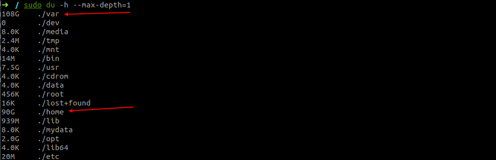

# Ubuntu18.04 系统配置

## 搜狗输入法安装

:::tip
我的是 Win11 + Ubuntu18.04双系统
如果按照按照官网的教程直接安装，大概率安装好以后是无法使用的，可尝试如下方法修复。虚拟机或 Ubuntu 单系统也可参考。
:::

- 先卸载掉fcitx，及其所有相关的软件。

```shell
sudo apt -y --purge remove fcitx
sudo apt clean fcitx
```

- 然后安装一些依赖。

```shell
sudo apt -y install fcitx fcitx-bin fcitx-table fcitx-table-all
sudo apt -y install fcitx-config-gtk
sudo apt -y install fcitx-libs libfcitx-qt0 libopencc2 libopencc2-data libqt4-opengl libqtwebkit4
```

- 下载搜狗拼音。
:::tip
只能下载2.3版本（或者其他2.x版本）的，不要下载官网3.x或者4.x版本，不然安装了也用不了，这是最关键的一点，切记！！！
:::
```shell
wget http://cdn2.ime.sogou.com/dl/index/1571302197/sogoupinyin_2.3.1.0112_amd64.deb
```

- 安装搜狗拼音。

可以直接双击 .deb 文件，也可以执行下面命令安装

```shell
sudo dpkg -i sogoupinyin_2.3.1.0112_amd64.deb

# 如果安装失败，请执行如下命令安装依赖，然后再执行上面的安装命令
sudo apt -f install
```

- 安装完以后，重启电脑，在语言支持里将输入法改为 fcitx。

    

    

- 打开 Fcitx Configure，添加搜狗输入法。

    

- 至此，应该就可以使用搜狗输入法了。


## 安装 VScode


:::tip
Ubuntu 的应用市场安装的 VSCode 是 snap 的削减版本，不支持中文。如果是从 Ubuntu 应用市场安装的，卸载之后从官网下载安装。
:::

- 卸载 snap 版本。
```shell
 sudo snap remove code
```

- 官网下载安装。

官网：[https://code.visualstudio.com/Download](https://code.visualstudio.com/Download)

下载后可以直接双击 .deb 文件，也可以执行下面命令安装

```shell
sudo dpkg -i xxxxx
```

## 安装 zsh 和 oh my zsh

- 参考：

[zsh-syntax-highlighting zsh-autosuggestions](zsh-syntax-highlighting zsh-autosuggestions)

[https://zhuanlan.zhihu.com/p/19556676](https://zhuanlan.zhihu.com/p/19556676)

## 磁盘清理

- 进入根路径。
```shell
cd /
```

- 查看磁盘挂载和占用情况。

```shell
df -hl
```

- 排查哪些目录占用空间较大。

```shell
du -h --max-depth=1
```


- 继续进入较大的目录执行如上命令。


- 所有文件从大到小展示。
```shell
ls -lhS
```


- 清空日志。
```shell
sudo truncate -s 0 /var/log/syslog.1
```


## Ubuntu 安装 Vscode server

```shell
# 映射的端口最好是对应的，如果是 vue 项目启动后它会再调 http://${服务器 ip}:${容器内端口}/sockjs-node/info?t=1684373820388，假如端口不一致的话，它就访问不到容器内了。
docker run --privileged -d \
  --name=code-server \
  -e PUID=1000 \
  -e PGID=1000 \
  -e TZ=Etc/UTC \
  -e PASSWORD=ken123 \
  -e SUDO_PASSWORD=ken123 `#optional` \
  -e DEFAULT_WORKSPACE=/config/workspace \
  -p 8443:8443 \
  -p 9090:9090 \
  -p 9091:9091 \
  -v $HOME/code-server/config:/config \
  --restart unless-stopped \
  lscr.io/linuxserver/code-server:latest
```

- 进入容器内部安装 vue-cli
```shell
docker exec -it code-server bash

sudo apt-get update

sudo apt-get install build-essential

curl -o- https://raw.githubusercontent.com/creationix/nvm/v0.33.0/install.sh | bash

nvm install 16.19.1

npm install --global vue-cli
```

- 容器内查看防火墙
```shell
sudo apt-get install ufw

sudo ufw status
```

- 访问容器内启动的 vue 项目
:::tip
要把项目目录中 /config/index.js 中的 host:'localhost' 改成  host: '0.0.0.0' 才能从宿主机访问到内部的服务端口
:::


## 杀掉进程

- 安装 lsof
```shell
sudo apt-get install lsof

# 可能需要先更新一下
sudo apt-get update
```


```shell
kill -9 $(lsof -i:9000 -t)
```

--------------
<br><br><br>
 <template>
  <Vssue :issue-id="2" />
</template>
