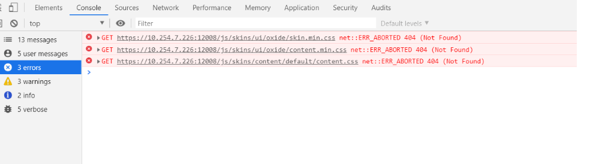

# Vue

官网：[https://v2.cn.vuejs.org/](https://v2.cn.vuejs.org/)

runoob 教程：[https://www.runoob.com/vue2/vue-tutorial.html](https://www.runoob.com/vue2/vue-tutorial.html)

## 安装

:::tip
前提是安装好了 npm，cnpm 或 yarn
:::

- 全局安装 vue-cli 。

```shell
yarn global add vue-cli
```

## 创建一个基于 webpack 模板的新项目

```shell
vue init webpack my-project
```

可参考 runoob 教程：[https://www.runoob.com/vue2/vue-tutorial.html](https://www.runoob.com/vue2/vue-tutorial.html)

## vue2 使用 tinymce 富文本编辑器

集成好之后，使用富文本编辑器的时候本地 npm run serve 运行没有问题，但是打包成 dist 使用 nginx 运行的时候出现问题：
`/js/skins/ui/oxide/content.min.css net::ERR_ABORTED 404 (Not Found)`



解决办法是把 tinymce 拷贝到 public 目录中，然后加上

```js
init: {
    ...
    ...
    ...
    skin_url: '../../../tinymce/skins/ui/oxide', // skin路径，这里可以引用到 public 中的，虽然我也没有写前缀，疑惑,不过解决了打包部署后访问不到 css 文件的问题。
    content_css: '../../../tinymce/skins/content/default/content.min.css',
},
```

## 部署之后使用 www. 开头的域名转发到前端服务，浏览器 tab 的 icon 不显示问题。

其它开头的域名比如 front.xxx.xyz，代理到前端服务上可以正常显示 icon。

## 使用 nginx 部署 vue 打包好的文件时刷新报错解决。

- 在nginx配置的 location 中加上 `try_files $uri $uri/ /index.html;` 这个就行，例如：

```shell
location / {
    root   html/dist;
    index  index.html index.htm;
    try_files $uri $uri/ /index.html;
}
```

## 初始化项目

- 安装 vue-cli

官网 [https://cli.vuejs.org/zh/guide/](https://cli.vuejs.org/zh/guide/)

```shell
# 指定版本安装
npm install -g @vue/cli@5
```

- 安装 ant-design-vue

```shell
npm install ant-design-vue@1
```

- 安装 vue-router

```shell
npm install vue-router@3
```

- 安装 axios

```shell
npm install axios
```

- 安装 babel-plugin-import

[https://juejin.cn/post/7051206427402043423](https://juejin.cn/post/7051206427402043423)

```shell
npm install babel-plugin-import --save-dev
```

## 登录

### 多租户登录流程

- 根据输入的邮箱查询所有 users（每个 user 对应一个 租户）。
- 验证密码正确则返回该邮箱对应所有租户并设置一个 accessCode （可以用 uuid）到 redis 为一分钟，跟所有 users 一起返回。
- 登录验证传入的租户 id 和 accessCode，生成 accessToken 记录到 cookie 并标记登录成功返回用户信息。
