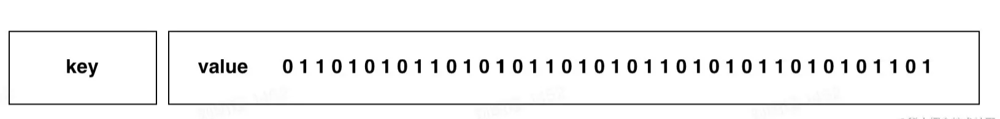

# Redis 基础知识

- Bitmap

Bitmap，即位图，是一串连续的二进制数组（0和1），可以通过偏移量（offset）定位元素。BitMap通过最小的单位bit来进行0|1的设置，表示某个元素的值或者状态，时间复杂度为O(1)。由于bit是计算机中最小的单位，使用它进行储存将非常节省空间，特别适合一些数据量大且使用二值统计的场景。

这里的二值状态就是指集合元素的取值就只有 0 和 1 两种。例如在签到打卡的场景中，我们只用记录签到（1）或未签到（0），所以它就是非常典型的二值状态。在签到统计时，每个用户一天的签到用 1 个 bit 位就能表示，一个月（假设是 31 天）的签到情况用 31 个 bit 位就可以，而一年的签到也只需要用 365 个 bit 位，根本不用太复杂的集合类型。这个时候，我们就可以选择 Bitmap。
Bitmap不属于Redis的基本数据类型，而是基于String类型进行的位操作。而Redis中字符串的最大长度是 512M，所以 BitMap 的 offset 值也是有上限的，其最大值是：`8 * 1024 * 1024 * 512  =  2^32`