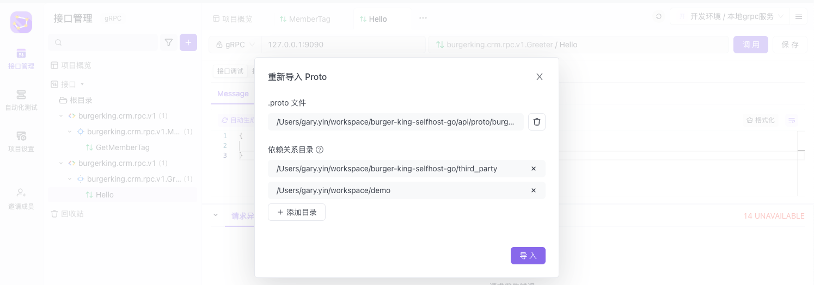
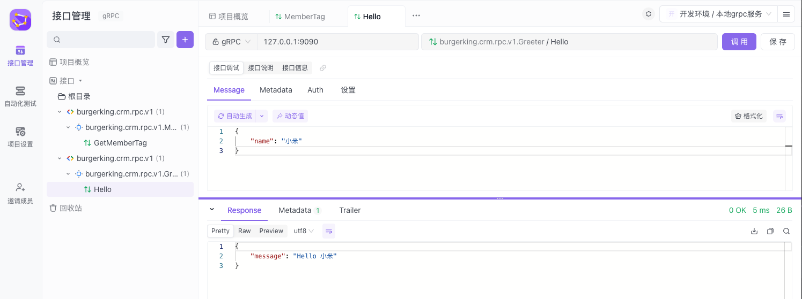

# Apifox

## grpc调用

- 到主页新grpc项目

- 导入proto文件和依赖的目录。

例如导入 member.proto

如果报错如下，则需要找到proto文件中导入的相关`google/protobuf/descriptor.proto`拷贝内容，自建例如：demo/google/protobuf/descriptor.proto，然后导入这个目录：

导入成功如下：

- 右上角配置环境IP和端口

调用成功：
