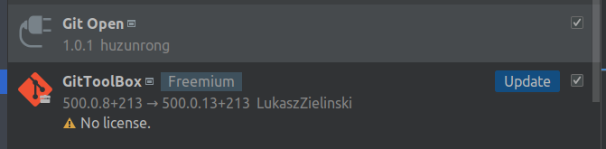

# Goland

## 常用快捷键

- 选中方法点击 `Ctrl+Enter` 可以添加该方法的测试代码

- 选中一段代码点击 `Command+Alt+M` 提取方法

- 测试代码文件中点击 `Ctrl+Enter` 添加测试代码

- 按住Shift + Alt，再按鼠标左键向上滑动，可以使一列上出现多个光标。

- 按住Alt，再按鼠标左键，可以多行出现光标进行多行编辑。

## 常用插件




## 解决 proto 文件报红问题


添加 proto 文件路径


## goland 调试 docker 容器中的 go 代码

- github clone delve 源码。

```shell
git clone https://github.com/go-delve/delve.git
```

- 编译。

```shell
cd $GOPATH/src
go install github.com/go-delve/delve/cmd/dlv
```

- 编译完成后 dlv 文件就在 $GOPATH/bin 目录下了，可以以下命令查看版本信息：

```shell
dlv -v
```

- 准备 demo。

```shell
package main

import (
	"crypto/md5"
	"fmt"
	"html/template"
	"io"
	"log"
	"net/http"
	"os"
	"strconv"
	"strings"
	"time"
)

func sayHelloName(w http.ResponseWriter, r *http.Request) {
	r.ParseForm()       // 解析参数，默认是不会解析的
	fmt.Println(r.Form) // 这些信息是输出入服务器的打印信息
	fmt.Println("path ", r.URL.Path)
	fmt.Println("scheme ", r.URL.Scheme)
	fmt.Println(r.Form["url_long"])
	for k, v := range r.Form {
		fmt.Println("key:", k)
		fmt.Println("value", strings.Join(v, ""))
	}
	fmt.Fprintf(w, "hello vic")

}

func login(w http.ResponseWriter, r *http.Request) {
	fmt.Println("method ", r.Method)
	if r.Method == "GET" {
		t, _ := template.ParseFiles("login.html")
		log.Println(t.Execute(w, nil))
	} else {
		r.ParseForm() // 如果注释这句不会有输出 默认情况下，Handler里面是不会自动解析form的，必须显式的调用r.ParseForm()后，你才能对这个表单数据进行操作
		//请求的是登录数据，那么执行登录的逻辑判断
		fmt.Println("username:", r.Form["username"])
		fmt.Println("password:", r.Form["password"])
	}

}
func upload(w http.ResponseWriter, r *http.Request) {
	fmt.Println("method:", r.Method) //获取请求的方法
	if r.Method == "GET" {
		crutime := time.Now().Unix()
		h := md5.New()
		io.WriteString(h, strconv.FormatInt(crutime, 10))
		token := fmt.Sprintf("/x", h.Sum(nil))

		t, _ := template.ParseFiles("upload.html")
		fmt.Println(token)
		t.Execute(w, nil)

	} else {
		r.ParseMultipartForm(32 << 20)
		file, handler, err := r.FormFile("uploadfile")
		if err != nil {
			fmt.Println(err)
			return
		}
		defer file.Close()
		fmt.Fprintf(w, "%v", handler.Header)
		f, err := os.OpenFile("./test/"+handler.Filename, os.O_WRONLY|os.O_CREATE, 0666) // 此处假设当前目录下已存在test目录
		if err != nil {
			fmt.Println(err)
			return
		}
		defer f.Close()
		io.Copy(f, file)

	}

}

func main() {
	http.HandleFunc("/v2", sayHelloName) //设置访问路由
	http.HandleFunc("/login", login)
	http.HandleFunc("/upload", upload)
	err := http.ListenAndServe(":9090", nil) // 设置监听端口
	if err != nil {
		log.Fatal("ListenAndServe: ", err)
	}
}
```

- 准备启动脚本 start.sh。

```shell
#!/bin/bash
dlv debug --headless --listen=:2345 --api-version=2 --accept-multiclient   $GOPATH/src/web.go
```

- 编写 Dockerfile。

```shell
FROM golang:1.19

RUN mkdir /web/

COPY ./dlv /usr/local/bin/
COPY ./web.go /go/src
COPY ./start.sh  /web/
RUN chmod   u+x /web/start.sh
WORKDIR /go/src/
ENTRYPOINT ["/web/start.sh"]
```

- 构建镜像。

```shell
docker build . -t web:1.0
```

- 运行镜像。

```shell
docker run -d  -p 9090:9090 -p 2345:2345 --privileged  web:1.0
```

- goland 的配置。


访问： `curl localhost:9090/v2`


## git使用

- 合并分支

比如想把feat-1合并到master，需要先切到master分支


也可以点击工具栏总的git，选择merge


