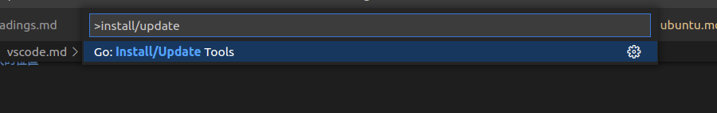
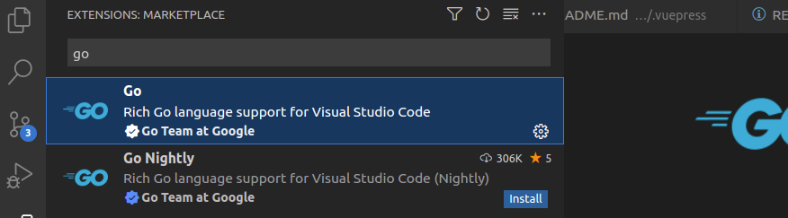

# Vscode 配置

## 怎么修改 vscode terminal 字体大小间距？

- 首先，点击【file】，点击【preferences】，点击【settings】

- 在设置窗口，输入【terminal】搜索到与terminal相关的设置选项

- 或者直接在目录中点击【terminal】，展开其中的设置选项

- 找到有关于字体Font的设置选项，比如Font Size字体大小，Font Family字体，还有间距、加粗等

- 修改 Font Family
```shell
Consolas, 'Courier New', monospace
```

或者
```shell
'Droid Sans Mono', 'monospace', monospace
```

## 回到上一次的位置

- Windows
```shell
alt + 左键
```

- Ubuntu
```shell
ctrl + alt + -
```

## 点击进入方法

- 安装 tools
```shell
ctrl + shift + p
```


- 安装 go 插件


## Ubuntu 安装 Vscode server

```shell
# 映射的端口最好是对应的，如果是 vue 项目启动后它会再调 http://${服务器 ip}:${容器内端口}/sockjs-node/info?t=1684373820388，假如端口不一致的话，它就访问不到容器内了。
docker run --privileged -d \
  --name=code-server \
  -e PUID=1000 \
  -e PGID=1000 \
  -e TZ=Etc/UTC \
  -e PASSWORD=ken123 \
  -e SUDO_PASSWORD=ken123 `#optional` \
  -e DEFAULT_WORKSPACE=/config/workspace \
  -p 8443:8443 \
  -p 9090:9090 \
  -p 9091:9091 \
  -v $HOME/code-server/config:/config \
  --restart unless-stopped \
  lscr.io/linuxserver/code-server:latest
```

- 进入容器内部安装 vue-cli
```shell
docker exec -it code-server bash

sudo apt-get update

sudo apt-get install build-essential

curl -o- https://raw.githubusercontent.com/creationix/nvm/v0.33.0/install.sh | bash

nvm install 16.19.1

npm install --global vue-cli
```

- 容器内查看防火墙
```shell
sudo apt-get install ufw

sudo ufw status
```

- 访问容器内启动的 vue 项目
:::tip
要把项目目录中 /config/index.js 中的 host:'localhost' 改成  host: '0.0.0.0' 才能从宿主机访问到内部的服务端口
:::
