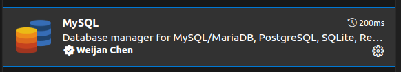
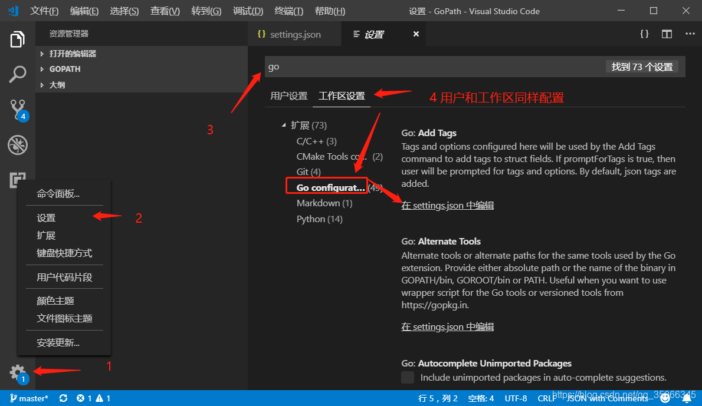
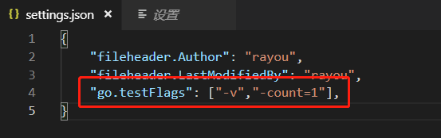
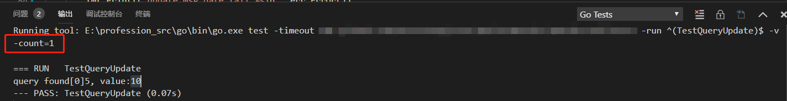

# Vscode

## 怎么修改 vscode terminal 字体大小间距？

- 首先，点击【file】，点击【preferences】，点击【settings】

- 在设置窗口，输入【terminal】搜索到与terminal相关的设置选项

- 或者直接在目录中点击【terminal】，展开其中的设置选项

- 找到有关于字体Font的设置选项，比如Font Size字体大小，Font Family字体，还有间距、加粗等

- 修改 Font Family

```shell
Consolas, 'Courier New', monospace
```

或者

```shell
'Droid Sans Mono', 'monospace', monospace
```

## 回到上一次的位置

- 在 Windows 中可以使用快捷键 `Alt + ←`实现。

- 在 Ubuntu 中可以使用快捷键`Ctrl + Alt+ -`实现。

- 在 Mac 中可以使用快捷键`Ctrl + -`实现。

## Golang 点击方法跳转配置

- 先开启 go module 参考：[https://goproxy.cn/](https://goproxy.cn/)

```shell
go env -w GO111MODULE=on
go env -w GOPROXY=https://goproxy.cn,direct
```

- 安装 tools

```shell
# 调出命令面板
ctrl + shift + p
```


- 安装 go 插件


## 怎么设置单击文件打开新的标签页？

- 方式一：双击文件。
- 方式二：workbench.editor.enablePreview 设置为 false。下图中的第三个选项。


## 便捷操作

- **ctrl+shift+p**  调出命令面板
- **alt+鼠标左键**  选中多行同时编辑
- **ctrl+shift+L**  选中编辑代码中相同的内容
- **选中多行**,按**tab**键可统一向右移动
- 选中文本后,Ctrl  +  \[      和   Ctrl  +  ]可实现文本的向左移动 和 向右移动
- 按住**Ctrl + Shift**，再按键盘上的上或下键，可以使一列上出现多个光标。
- 选中一段文字，按**shift+alt+i**，在每行末尾都会出现光标
- 按**shift+alt**，再使用鼠标拖动，也可以出现竖直的列光标，同时可以选中多列。

## 常用插件


### 各种数据库插件

- 安装下面一个可以支持多种数据库连接


## vscode 执行 go test 测试结果没有更新

参考：
[https://blog.csdn.net/qq_35066345/article/details/89262974](https://blog.csdn.net/qq_35066345/article/details/89262974)

- 情况说明

这是因为测试并没有被实际运行，显示的是之前缓存的测试结果。从Go1.10开始，测试结果将被缓存，golang缓存测试结果这点在官方文档也能看到说明。见:[https://golang.org/cmd/go/#hdr-Testing_flags](https://golang.org/cmd/go/#hdr-Testing_flags)

- vscode 禁用 go test缓存

要禁用go test的缓存，需要添加参数:-count=1。那么go test的命令是这样子的：

```go
go test -v -count=1 gofile_test.go
```

在vscode中添加步骤：

1.左下角打开设置

2.配置项搜索 “go”

3.选择工作区设置，如果需要全局设置禁用缓存的话，用户设置也需要重复同样的操作

4.添加参数-count=1(-v 的参数设置是测试时显示打印信息)






