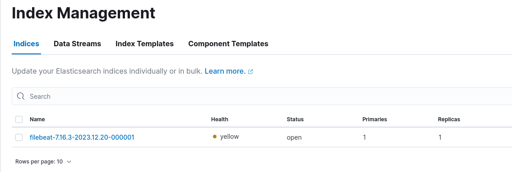
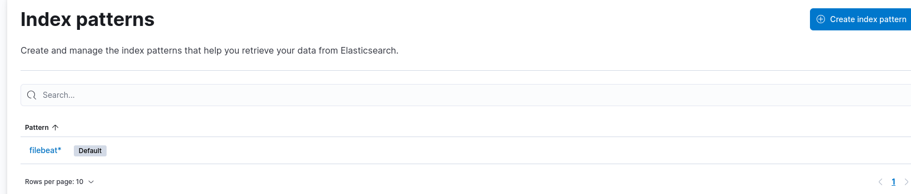
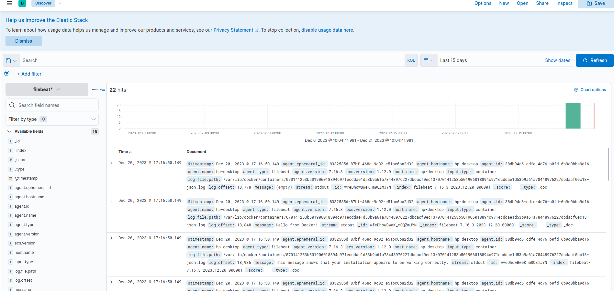
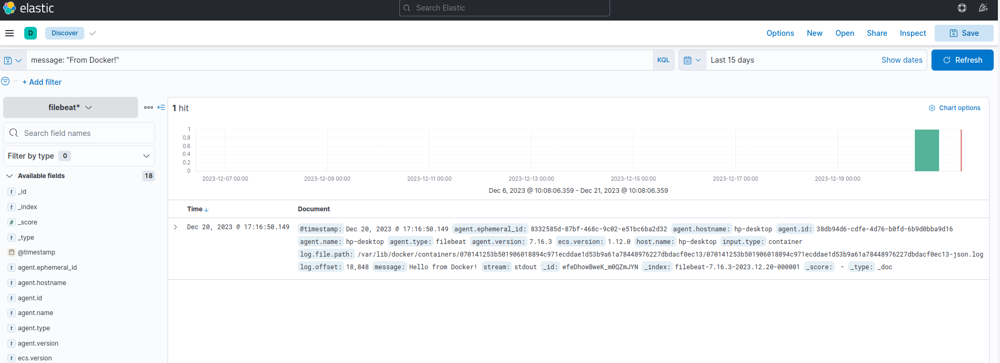

# filebeat

## 采集docker容器日志

[https://www.elastic.co/guide/en/beats/filebeat/7.16/filebeat-installation-configuration.html#filebeat-installation-configuration](https://www.elastic.co/guide/en/beats/filebeat/7.16/filebeat-installation-configuration.html#filebeat-installation-configuration)

- 下载

```txt
curl -L -O https://artifacts.elastic.co/downloads/beats/filebeat/filebeat-7.16.3-linux-x86_64.tar.gz
tar xzvf filebeat-7.16.3-linux-x86_64.tar.gz
```

- 启动Elasticsearch和Kibana

:::tip
注意版本需要跟filebeat保持一致。
:::

- 使用测试镜像

```shell
docker run --name test-container-log hello-world
# 查看日志
docker logs test-container-log
# 查看容器id
docker inspect test-container-log
```

- 修改配置filebeat.yml

```yml
filebeat.inputs:
  - type: container
    paths:
      # - /var/lib/docker/containers/*/*.log
      - /var/lib/docker/containers/070141253b501906018894c971ecddae1d53b9a61a78448976227dbdacf0ec13/*.log

filebeat.config:
  modules:
    path: ${path.config}/modules.d/*.yml
    reload.enabled: false

setup.kibana:

output.elasticsearch:
  hosts: ['localhost:9200']
```

- 启动filebeat

```shell
# 非root用户测试需要加sudo，因为没有/var/lib/docker/containers的访问权限
sudo chown root:root filebeat.yml
sudo ./filebeat -e -c filebeat.yml
```

- 再次启动容器测试

```shell
docker start test-container-log
```

- Kibana中查看多了一条索引



- 创建Index Pattern



- 查看Discover



- 输入词条查询



## 用法升级

:::tip
可以以docker方式运行filebeat，采集容器日志并发送到logstash，再通过logstash发送到阿里云或腾讯云的日志服务。
:::

## references

[https://www.tizi365.com/archives/723.html](https://www.tizi365.com/archives/723.html)

[https://segmentfault.com/a/1190000039410506](https://segmentfault.com/a/1190000039410506)

[https://developer.aliyun.com/article/790565](https://developer.aliyun.com/article/790565)
