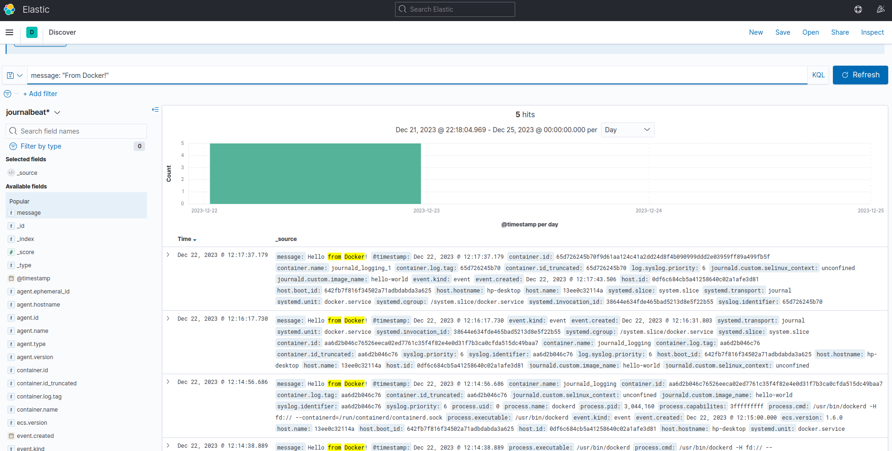

# journalbeat

[https://www.elastic.co/guide/en/beats/journalbeat/7.10/journalbeat-installation-configuration.html](https://www.elastic.co/guide/en/beats/journalbeat/7.10/journalbeat-installation-configuration.html)

## 使用

- 下载

```shell
curl -L -O https://artifacts.elastic.co/downloads/beats/journalbeat/journalbeat-7.10.2-linux-x86_64.tar.gz
tar xzvf journalbeat-7.10.2-linux-x86_64.tar.gz
```

- 启动Elasticsearch和Kibana

:::tip
注意版本需要与journalbeat保持一致。
已容器的方式启动设置在同一个 network: my_default
:::

- 修改配置journalbeat.yml

```yml
journalbeat.inputs:
  - id: docker.service
    paths: []
    include_matches:
      - _SYSTEMD_UNIT=docker.service
    seek: tail

output.elasticsearch:
  hosts: ['localhost:9200']
```

- 启动journalbeat

```shell
./journalbeat -e -c journalbeat.yml
```

- 指定container启动时的存储引擎（测试时候可以使用该方式）

```shell
docker run --name journald_logging --log-driver journald hello-world
```

- 更改docker的默认存储引擎（全部容器日志输出到journal）

```shell
vim /etc/docker/daemon.js

# 添加
{
    "log-driver": "journald"
}
# 重启docker服务
systemctl restart docker
```

- 启动测试日志容器

```shell
docker run --name journald_logging --log-driver journald hello-world
```

- 查看Kibana多了一个索引


- 创建Index Pattern


- 查看Discover


- 重启容器再次查看

```shell
docker start journald_logging
```

## 使用docker方式启动journalbeat

### 测试步骤

- 启动一个容器

```shell
docker run --rm \
  --name=test-ubuntu \
  --volume="/var/log/journal:/var/log/journal" \
  --volume="/etc/machine-id:/etc/machine-id" \
  --volume="/run/systemd:/run/systemd" \
  --volume="/etc/hostname:/etc/hostname:ro" \
  --net my_default \
  phusion/baseimage:focal-1.1.0

# 赋值journal到容器内根目录
docker cp journalbeat-7.10.2-linux-x86_64 test-ubuntu:/
# 进入容器
docker exec -it test-ubuntu bash
# 进入目录
cd journalbeat-7.10.2-linux-x86_64
# 修改配置
vim journalbeat.yml
```

配置

```yml
journalbeat.inputs:
  - id: docker.service
    paths: []
    include_matches:
      - _SYSTEMD_UNIT=docker.service
    seek: cursor

output.elasticsearch:
  hosts: ['elasticsearch:9200']
```

- 修改journalbeat.yml所有者和所属组

```shell
chown root:root journalbeat.yml
```

- 启动filebeat

```shell
./journalbeat -e -c ./journalbeat.yml
```

- 观察Kibana



- 再次启动日志容器观察Kibana

```shell
docker start journald_logging
```

### 升级用法

可以使用容器的方式运行journalbeat采集日志到logstash，再通过logstash发送到日志服务（阿里云或腾讯云）
